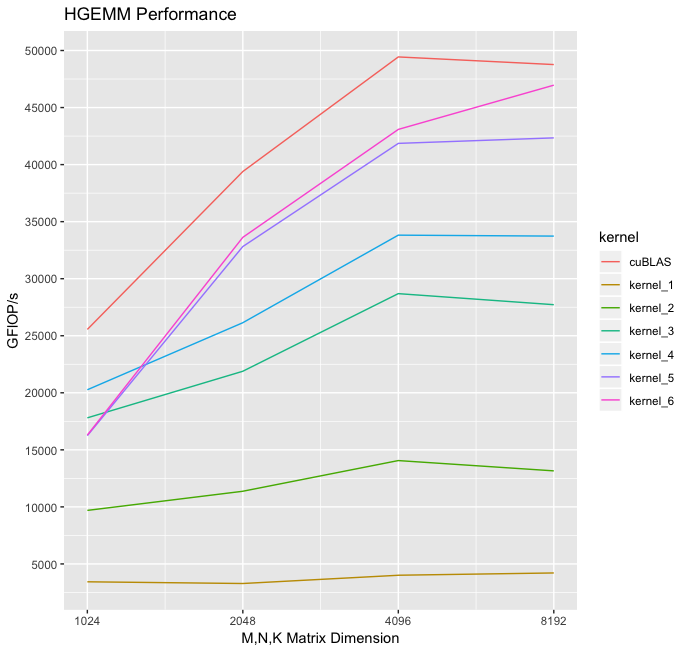

# Original author

https://alexarmbr.github.io/2024/08/10/How-To-Write-A-Fast-Matrix-Multiplication-From-Scratch-With-Tensor-Cores.html

```bash
# On SFU machines
module load cuda/12.6
cmake -B build -S . -DCMAKE_BUILD_TYPE=Release
cd build; make -j 10
chmod +x ../profile.sh
./profile.sh # If it complains about permissions; run as sudo so you can set the GPU and DRAM clock speeds
```

# matmul-playground

This repo contains six implementations of a half precision GEMM kernel that progressively get more and more optimized. Kernel #6 achieves about 95% of the throughput of `cublasHgemm` for M,N,K=8192,8192,8192 matrices.


# setup
This repo contains a minimal Dockerfile that installs cmake on top of an `nvcr.io/nvidia/cuda` base image, this is sufficient to build and run the code in this repo.

Two helpful docker run flags are:
- `--gpus=all`, gives you access to the GPU inside the container
-  `--cap-add=CAP_SYS_ADMIN`, enables you to run nsight compute inside the container
This repo was developed and benchmarked on a `g4dn.xlarge` ec2 instance, which costs about 50 cents per hour, and gives you access to a single Tesla T4 GPU.

# usage
in order to profile the six kernels, along with `cublasHgemm` on a variety of matrix sizes, from inside the docker container run `./profile.sh`. This script locks the GPU and DRAM clock speeds for consistent results.