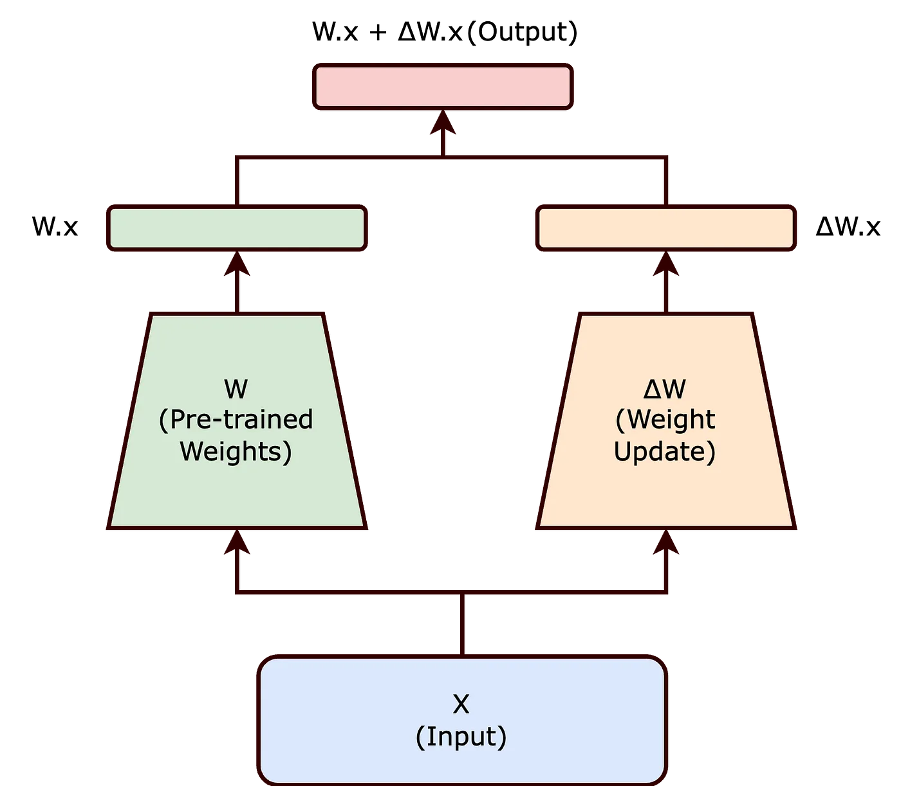

Welcome to the Large Language Model (LLM) learning repository! This repo is designed to help first-year students understand the fundamentals of LLMs through both theoretical explanations and hands-on practice with Python scripts and Jupyter notebook.

- [Terms](#terms)
  - [1. LLM (Large Language Model): A type of artificial intelligence model designed to understand and generate human-like text based on the input it receives.](#1-llm-large-language-model-a-type-of-artificial-intelligence-model-designed-to-understand-and-generate-human-like-text-based-on-the-input-it-receives)
    - [**Popular distribution formats**](#popular-distribution-formats)
    - [Popular models](#popular-models)
  - [2. GPU (Graphics Processing Unit):](#2-gpu-graphics-processing-unit)
    - [CUDA:](#cuda)
    - [Pytorch:](#pytorch)
  - [3. Running locally:](#3-running-locally)
  - [4. LLAMA cpp:](#4-llama-cpp)
  - [5. VLLM (Virtual Large Language Model):](#5-vllm-virtual-large-language-model)


## Terms


```bash
# At SFU, RCG maintains the set of drivers and CUDA toolkit.
$ module avail
$  module load LIB/CUDA/12.6
```

### 1. LLM (Large Language Model): A type of artificial intelligence model designed to understand and generate human-like text based on the input it receives. 

- **Model Size**: Determined by the number of floats in the matrices (7B, 32B, etc.)
- **State-of-the-art models**: General-purpose models have 100s of billions of parameters
- 
#### **Popular distribution formats**

- **GGUF**: An efficient file format created by Gregory Gerganov for storing and sharing large language models. It is designed to be compact and fast, making it suitable for deployment in various applications.
  - Contains model weights, configuration, and metadata
  - Allows easy loading across different platforms
  - [GGUF Documentation](https://huggingface.co/docs/hub/en/gguf)

- **Safe Tensors**: A file format for storing tensors that ensures safety and integrity during model loading and sharing.
  - Prevents model corruption or tampering
  - Provides secure handling of large language models
  - Used with frameworks like Hugging Face Transformers
  - [Safe Tensors Documentation](https://huggingface.co/docs/diffusers/using-diffusers/other-formats)

- **Huggingface Hub**   : It provides a centralized repository the community to upload, download, and manage their models and datasets.

```bash
pip install -U "huggingface_hub
# Create login at https://huggingface.co
# Create access token
huggingface-cli login # Use access token
# Downloading a model
huggingface-cli download HuggingFaceH4/zephyr-7b-beta
# Downloaded model will be saved in ~/.cache/huggingface/hub
```
#### Popular models

| Model (🤗 repo)                                  | Params       | Capability | Fine-tune on 1× 4090?\*  | Inference on 1× 4090? | Key notes                                                                                             |
| ------------------------------------------------ | ------------ | ---------- | ------------------------ | --------------------- | ----------------------------------------------------------------------------------------------------- |
| `codellama/CodeLlama-7b-hf` or 13b               | 7 B          | Coding     | **Yes** (QLoRA)          | **Yes**               | Alpaca-LoRA recipe runs in hours on 4090 ([github.com][9])                                            |
| `unsloth/codellama-34b-bnb-4bit`                 | 34 B (4-bit) | Coding     | **Yes** (QLoRA, rank≤32) | **Yes** (≈20 GB)      | Unsloth: “34 B finally does **not** OOM, 32 % less VRAM” ([reddit.com][10], [huggingface.co][11])     |
| `codefuse-ai/CodeFuse-DeepSeek-33B-4bits`        | 33 B (4-bit) | Coding     | **LoRA only** (tight)    | **Yes**               | 4-bit quant loads on 4090; full-rank finetune needs >24 GB ([huggingface.co][13])                     |
| `mistralai/Mistral-7B-Instruct-v0.2`             | (7B)         | Language   | **LoRA only** (tight)    | **Yes**               | Highly efficient for its size, it can be fine-tuned and run for various language tasks without issue. |
| `nvidia/Nemotron-Research-Reasoning-Qwen-1.5B` | 1.5 B        | Coding   | **Yes** (QLoRA)          | **Yes**               |  Research, and math, reasoning                         |
| `google/codegemma-7b`                        | 7 B          | Coding     | **Yes** (QLoRA)          | **Yes**               | Code generation and understanding tasks; efficient for coding applications.                           |
| `microsoft/swinv2-base-patch4-window12-192-22k`  | ≈ 88 M       | Vision     | **Yes** (full or LoRA)   | **Yes**               | Compact ViT backbone; well within 24 GB ([huggingface.co][1])                                         |
| `google/vit-base-patch16-224`                    | 86 M         | Vision     | **Yes**                  | **Yes**               | Vanilla ViT; 86 M params ([kaggle.com][2])                                                            |
| `facebook/convnext_large` (`convnext-large-22k`) | 197 M        | Vision     | **Yes** (LoRA ≤6 GB)     | **Yes**               | 197 M params; LoRA fits easily ([openreview.net][3])                                                  |
| `openai/clip-vit-large-patch14`                  | 430 M        | Multimodal | **Yes†**                 | **Yes**               | Vision + text encoder; LoRA batch≈8 fits 4090 ([reddit.com][4])                                       |
| `llava-hf/llava-v1.6-mistral-7b-hf`              | 7 B          | Multimodal | **Yes** (QLoRA)          | **Yes** (≈8 GB fp16)  | Unsloth lets 7 B LoRA train & 56 k ctx on 4090 ([huggingface.co][5], [reddit.com][6])                 |
| `Salesforce/blip2-opt-2.7b`                      | 2.7 B        | Multimodal | **Yes** (PEFT)           | **Yes**               | BLIP-2 LoRA tutorials show 24 GB is plenty ([huggingface.co][7], [discuss.huggingface.co][8])         |
| `bigcode/starcoder2-7b`                          | 7 B          | Coding     | **Yes**                  | **Yes**               | 7 B GQA model; GGUF/4-bit fits <6 GB ([huggingface.co][12])                                           |

#### THE TRANSFORMER ARCHITECTURE

- **THE transformer, tokens**: The architecture that underpins most LLMs, introduced in the paper "Attention is All You Need" by Vaswani et al. in 2017. An architecture is a collection of layerwise processing where each layer is a matrix operation beween activations (a matrix that represents the input) and weights (a `learned matrix` where the values represent some notion of knowledge and interactions between knowledge). 
  
- **Tokens**: The basic units of text that LLMs process. Tokens can be words, subwords, or characters, depending on the tokenization method used. For example, the sentence "I love programming" might be tokenized into ["I", "love", "programming"] or ["I", "lov", "e", "program", "ming"] depending on the tokenizer. Tokenization is a crucial step in preparing text data for LLMs, as it converts raw text into a format that the model can understand and process.
- **Attention Matrix**: A matrix that represents the relationships between tokens in a sequence. It is used to compute how much focus each token should have on every other token in the sequence.

- [Basics of Transformer Architecture](https://jalammar.github.io/illustrated-transformer/)
- [3blue1brown: The Transformer](https://youtu.be/LPZh9BOjkQs?si=gyx2xflnzfXj5E65)


### 2. GPU (Graphics Processing Unit): 

In the context of LLMs, GPUs are used to perform the heavy matrix multiplications and other matrix operations required for training and running these models efficiently. The amount of memory on the GPU is a limiting factor in the size of the model that can be run. For example, a 24GB GPU can run models with up to 7B \* 32 bit parameters.

#### CUDA: 

A parallel computing C-like language platform and application programming interface (API) model created by NVIDIA. Highly parallel language. In the context of LLMs, CUDA is often used to accelerate the training and 
inference of these models.
- [GPU Gloassary](https://modal.com/gpu-glossary/device-hardware/tensor-core)
- [Brief History of GPUs](https://fabiensanglard.net/cuda/)
- [Tensor Cores](https://semianalysis.com/2025/06/23/nvidia-tensor-core-evolution-from-volta-to-blackwell/)
- [Mem Model](https://www.nvidia.com/en-us/on-demand/session/gtc25-s72683/)
- [H100. GEMM](https://cudaforfun.substack.com/p/outperforming-cublas-on-h100-a-worklog)
- [Blackwell GEMM](https://research.colfax-intl.com/cutlass-tutorial-writing-gemm-kernels-using-tensor-memory-for-nvidia-blackwell-gpus/)
- [MMA and WMMA](https://github.com/Bruce-Lee-LY/cuda_hgemm/tree/master/src/wmma), [Notes](https://bruce-lee-ly.medium.com/nvidia-tensor-core-getting-started-with-mma-ptx-programming-508e44a6cb7d)
- [FAST GEMM 1](https://siboehm.com/articles/22/CUDA-MMM)
- [FAST GEMM 2](https://alexarmbr.github.io/2024/08/10/How-To-Write-A-Fast-Matrix-Multiplication-From-Scratch-With-Tensor-Cores.html)
- [Advanced: CUDA graphs](https://pytorch.org/blog/accelerating-generative-ai-2/)
# CUDA Alternatives and DSLs
- [Triton](https://triton-lang.org/): A python embeded domain-specific language (DSL). It allows developers to write custom GPU kernels in a Python-like syntax, making it easier to optimize and parallelize computations for LLMs and other applications. Triton is particularly useful for implementing custom operations that are not available in standard libraries, enabling fine-tuned performance on specific hardware configurations.
- [Modular](https://www.modular.com/): A platform that provides tools and infrastructure for building and deploying AI models, including LLMs. 
- [Triton vs Modular](https://www.modular.com/blog/democratizing-ai-compute-part-7-what-about-triton-and-python-edsls)


#### Pytorch: 

THE python library for deep learning. It provides a flexible and efficient way to build and train neural networks, including LLMs. Pytorch is widely used in the research community and has become the standard framework for many LLM implementations.

Both pytorch and cuda are super-sensitive to the version of the GPU driver and the CUDA toolkit installed on your system. It is important to ensure that the versions of pytorch and cuda are compatible with each other and with your GPU driver. Best practice is to use a virtual environment (e.g., conda or venv) to manage dependencies and avoid conflicts. This step assumes appropriate GPU drivers and CUDA toolkit are already installed on your system.

[CUDA Installation Guide](https://developer.nvidia.com/cuda-downloads?target_os=Linux&target_arch=x86_64&Distribution=Debian&target_version=12&target_type=deb_local)
[Pytoch docker](https://hub.docker.com/layers/pytorch/pytorch/2.7.1-cuda12.6-cudnn9-devel/images/sha256-639b8229ccfd8a3aa803cf49c33d6d6fe406750d79aaf723fe8c0eb1060d8cff)
[Modern GPU Programming with CUDA](https://www.nvidia.com/en-us/on-demand/session/gtc25-s72449/)
[GPU Embedded-DSLs](https://www.modular.com/blog/democratizing-ai-compute-part-7-what-about-triton-and-python-edsls)


### 3. Running locally: 

This refers to executing code or models on your own computer or local machine. For instance to run model with 28 billion parameters we could quantize (meaning reduce the precision of the weights) the model to 8 bits, which would allow it to fit into a 24GB GPU. This is often done to make it feasible to run larger models on consumer-grade hardware.
   [Model size estimator](https://huggingface.co/docs/accelerate/en/usage_guides/model_size_estimator)

LLAMA (Large Language Model Meta AI): A family of large language models developed by Meta (formerly Facebook). LLaMA models are designed to be efficient and effective for a variety of natural language processing tasks. They come in various sizes, such as LLaMA-7B, LLaMA-13B, and LLaMA-30B, indicating the number of parameters in billions.

### 4. LLAMA cpp: 

A C++ implementation of the LLaMA model that allows for efficient inference on CPU and GPU. It is designed to be lightweight, fast, with few dependencies. It can run in isolation as a standalone binary in the command line without a python environment (easy to setup on any unix system even one with only cpus).

```bash
git clone https://github.com/ggml-org/llama.cpp
cd llama.cpp; 
cmake -GNinja -B Build . -DGGML_CUDA=ON -DGGML_AVX512=ON -DGGML_CUDA_FA_ALL_QUANTS=ON -DGGML_CUDA_MMV_Y=2 -DGGML_CUDA_PEER_MAX_BATCH_SIZE=4096 -DGGML_CUDA_USE_GRAPHS=ON
make -j"$(nproc)" LLAMA_CUDA=1          # CUDA 12.x required. module load LIB/CUDA/12.6  or similar if on Mac
huggingface-cli download Qwen/Qwen3-0.6B --local-dir ./models/Qwen3-0.6B
# Convert model to specific format. Here bf16 (bfloat16) is used, which is a common format for efficient inference (if the GPU supports it). Apple may not
python3 convert_hf_to_gguf.py --outtype bf16 ./models/Qwen3-0.6B
./build/bin/llama-cli -m ./models/Qwen3-0.6B/Qwen3-0.6B-BF16.gguf
```

### 5. VLLM (Virtual Large Language Model): 

A framework that came out of Berkeley's skylab to enable LLMs to run on GPUs with limited memory (similar to virtual memory in operating systems). It is a prompt caching framework that is useful when you want to run a server to support multiple users or applications accessing the same model. 
`WARNING: VLLM current requires CUDA`


### 6. Fine-tuning: Unsloth

 The process of taking a pre-trained LLM and training it further on a specific dataset or task to improve its performance in that domain. Fine-tuning adjusts the model's weights based on new data, allowing it to adapt to specific requirements or domains. 
 
 Key points to make it practical on consumer GPUs
 - Target smaller models (e.g., 7B, 13B, 34B)
 - Use smaller dataset.
 - Update only subset of weights (e.g., LORA, PEFT). Create a patch matrix that is loaded in along with base model during inference.
 - Use quantization techniques to reduce memory footprint
 - Use checkpointing to offload GPU memory to CPU memory during training

- [Unsloth Fine-tuning Guide](https://docs.unsloth.ai/get-started/fine-tuning-guide)
- [What makes unsloth so special?](https://www.youtube.com/watch?v=pRM_P6UfdIc) (**Short Answer**: Block Sparsity. Quantized Lower-ranked LORA, Checkpointing)
- [Unsloth Checkpointing](https://unsloth.ai/blog/long-context). (**On RTX 4090 on CS desktops: Can do 56k context with 7B model, 8k context with 34B model**)
- [GRPO](https://unsloth.ai/blog/grpo)


```bash
# If on cs-arch29 dependencies are already installed in /local-scratch/opt/miniconda3
$ . "/local-scratch/opt/miniconda3/etc/profile.d/conda.sh"
$ conda activate
# if you want to install packages locally for yourself do pip install --user
# If not on cs-arch29
pip3 install requirements.txt
# Gotchas. The versions of pytorch, torchvision and torchaudio must match the CUDA toolkit version.
# If running notebooks, run with vscode interactively otherwise
# Derived from unsloth circa June 2025.
python3 01_llm_tuning.py
# This will create a local copy (temporary duplication)
ls Phi4-HF/ # Base model
ls Phi4-LORA/ # LORA model. THE PATCH
# If you want to run with llama.cpp
cd llama.cpp;  
python3 convert_hf_to_gguf.py --outtype q8_0 ../Phi4-HF
python3 convert_lora_to_gguf.py --outtype q8_0 ../Phi4-LORA
./Build/bin/llama-cli -m ../Phi4-HF/Phi4-HF-15B-Q8_0.gguf --lora ../Phi4-LORA/Phi4-LORA-Q8_0-LoRA.gguf --color --interactive -p "Write a python script for printing the nth term in fibonacci"
```




### 7. Fine-tuning and Distillation 

LORA (Low-Rank Adaptation): A technique used to adapt pre-trained models to new tasks or domains by introducing low-rank matrices (smaller dimensions) into the model architecture. Instead of updating all the parameters of the model (e.g., NxN sized matrices), you create a low-rank patch matrices A: NxK and B: KxN, where K (typically 2---16) is much smaller than N. Multiplying A and B gives you a matrix of size NxN.


```bash
# 
python3 convert_hf_to_gguf.py --outtype q8_0  ~/.cache/huggingface/hub/models--unsloth--phi-4
python3 convert_lora_to_gguf.py --outtype q8_0 ../lora_model 
```


### 8. Distillation: 

A process of training a smaller model (the student) to mimic the behavior of a larger, pre-trained model (the teacher). The student model learns to approximate the outputs of the teacher model, allowing it to achieve similar performance with fewer parameters. Distillation is often used to create more efficient models that can run on devices with limited computational resources while retaining much of the performance of the original larger model.
