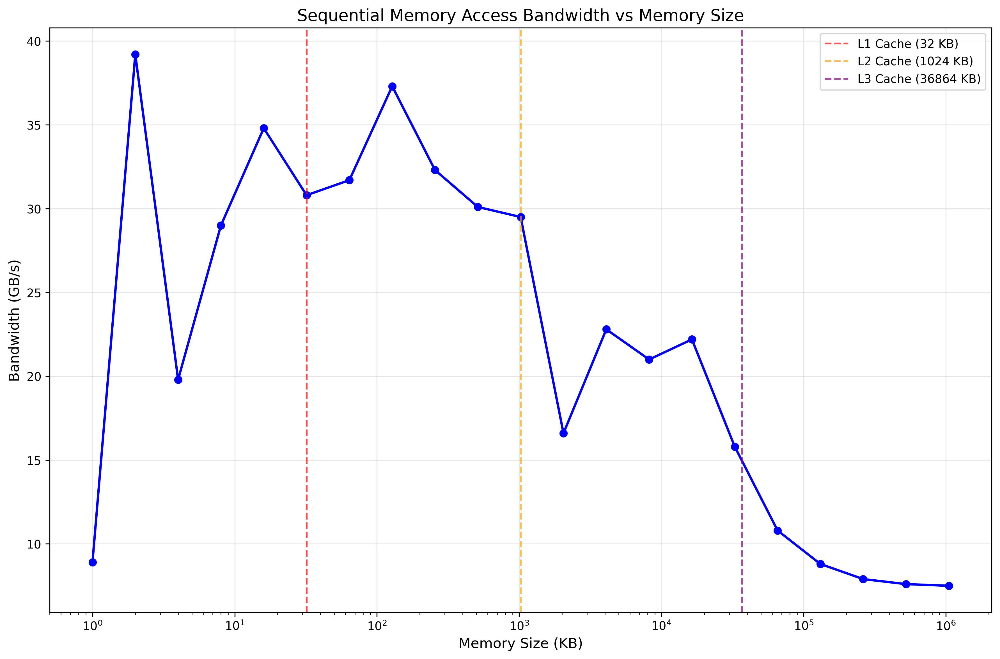
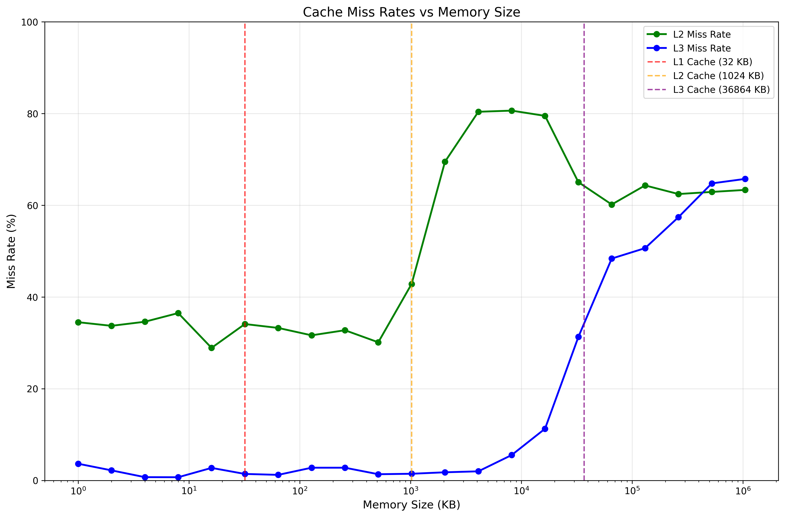
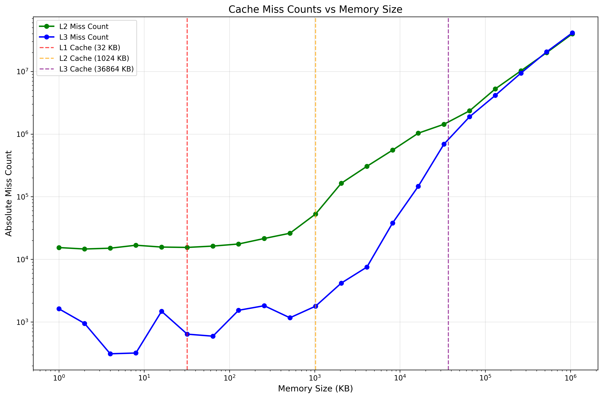

- [Dependencies](#dependencies)
- [Good benchmarking practices](#good-benchmarking-practices)
- [Memory Latency Checker Usage.](#memory-latency-checker-usage)
  - [Measure memory latencies](#measure-memory-latencies)
  - [numactl core and memory Bindings](#numactl-core-and-memory-bindings)
- [Memory benchmarking](#memory-benchmarking)
- [Example output](#example-output)
- [Performance Measurement](#performance-measurement)
  - [Obtain MLP.](#obtain-mlp)
      - [What “MLP” means](#what-mlp-means)
      - [Counters you need](#counters-you-need)
      - [Calculate the metric(s)](#calculate-the-metrics)
      - [Interpreting numbers](#interpreting-numbers)

# Dependencies
```bash
sudo apt-get install msr-tools
sudo apt-get install linux-tools-common
sudo apt-get install linux-tools-generic
sudo apt-get install numactl
# Older systems may require:
sudo apt-get install numactl-devel
sudo apt-get install libnuma-devel
```


# Good benchmarking practices

1. **Isolate the Benchmark**: Run benchmarks on a dedicated system or ensure minimal background processes to avoid interference.

```bash
# Assigns the threads created on benchmark to specific CPU cores.
# Note that typically linux assigns odd cores to one socket and even cores to another.
# In this example thus is an inefficient allocation with 2 threads per socket and threads spread out.
taskset -c 4,5,6,7 ./benchmark
# Better allocation would be:
taskset -c 0,2,4,6 ./benchmark
```


2. **Enable highest performance mode**: Set the CPU governor to "performance" mode to ensure maximum CPU speed.
   ```bash
   sudo cpufreq-set -r -g performance
   # OR 
   sudo cpupower frequency-set -g performance
   ```
3. Disable Enable Prefetchers
```bash
cpu-info | # Note down processor model and number
# Model specific registers (MSRs) are used to control CPU features.
# For prefetchers on Intel CPUs it is typically MSR_IA32_MISC_ENABLE 0x1a4
sudo rdmsr --all 0x1a4
sudo rdmsr -p 0 0x1a4
# IA32 bit0 = L2 hardware prefetcher, bit1 = L2 adjacent-line,
# bit2 = DCU streamer, bit3 = DCU IP, L2 prefetcher has option to prefetch into L2 or L3. Disabling it will disable both options
# Note that setting the bit disable the prefetcher, clearing the bit enables it.
sudo wrmsr -p 0 0x1a4 0xF # Disable all prefetchers
sudo wrmsr -p 0 0x1a4 0x0 # Enable all prefetchers
```


# Memory Latency Checker Usage.
Intel Memory Latency Checker (MLC) is a tool to measure memory latency on Intel processors. 
```bash
# Check numa settings
$ numactl -H                                    ∞
available: 2 nodes (0-1)
node 0 cpus: 0 2 4 6 8 10 12 14 16 18 20 22 24 26 28 30 32 34 36 38 40 42 44 46 48 50 52 54 56 58 60 62 64 66 68 70 72 74 76 78 80 82 84 86 88 90 92 94
node 0 size: 257556 MB
node 0 free: 209967 MB
node 1 cpus: 1 3 5 7 9 11 13 15 17 19 21 23 25 27 29 31 33 35 37 39 41 43 45 47 49 51 53 55 57 59 61 63 65 67 69 71 73 75 77 79 81 83 85 87 89 91 93 95
node 1 size: 258031 MB
node 1 free: 219370 MB
node distances:
node   0   1
  0:  10  21
  1:  21  10
# on cs-arch04
```

## Measure memory latencies
```bash
sudo ./mlc ∞
Intel(R) Memory Latency Checker - v3.11b
Measuring idle latencies for sequential access (in ns)...
		Numa node
Numa node	     0	     1
       0	  82.1	 141.0
       1	 141.5	  81.5

Measuring Peak Injection Memory Bandwidths for the system
Bandwidths are in MB/sec (1 MB/sec = 1,000,000 Bytes/sec)
Using all the threads from each core if Hyper-threading is enabled
Using traffic with the following read-write ratios
ALL Reads        :	158844.5
3:1 Reads-Writes :	150658.6
2:1 Reads-Writes :	149341.2
1:1 Reads-Writes :	143355.4
Stream-triad like:	128158.7

Measuring Memory Bandwidths between nodes within system
Bandwidths are in MB/sec (1 MB/sec = 1,000,000 Bytes/sec)
Using all the threads from each core if Hyper-threading is enabled
Using Read-only traffic type
		Numa node
Numa node	     0	     1
       0	79670.3	34393.4
       1	34385.7	79678.3

Measuring Loaded Latencies for the system
Using all the threads from each core if Hyper-threading is enabled
Using Read-only traffic type
Inject	Latency	Bandwidth
Delay	(ns)	MB/sec
==========================
 00000	329.26	 159154.0
 00002	330.68	 159225.6
 00008	330.86	 159201.7
 00015	329.26	 159040.5
 00050	326.68	 159171.9
 00100	325.98	 158992.6
 00200	293.81	 158637.6
 00300	127.88	 132998.9
 00400	110.64	 102244.7
 00500	101.15	  83217.0
 00700	 96.70	  60426.1
 01000	 91.30	  42927.2
 01300	 89.38	  33361.5
 01700	 88.10	  25747.4
 02500	 86.39	  17829.5
 03500	 84.41	  13006.8
 05000	 83.80	   9351.6
 09000	 82.63	   5555.4
 20000	 82.30	   2932.1

Measuring cache-to-cache transfer latency (in ns)...
Local Socket L2->L2 HIT  latency	49.5
Local Socket L2->L2 HITM latency	49.5
Remote Socket L2->L2 HITM latency (data address homed in writer socket)
			Reader Numa Node
Writer Numa Node     0	     1
            0	     -	 115.2
            1	 115.5	     -
Remote Socket L2->L2 HITM latency (data address homed in reader socket)
			Reader Numa Node
Writer Numa Node     0	     1
            0	     -	 184.8
            1	 185.9	     -
```

## numactl core and memory Bindings

On multi-socket systems, ensure your benchmark process and the memory it allocates are on the same NUMA node if you want to measure local NUMA latency. You can use tools like numactl for this:

```bash
numactl --cpunodebind=0 --membind=0 ./latency_benchmark
```

# Memory benchmarking
```bash
gcc -O3 -march=native -o membench membench.c
chmod +x run.sh
sudo ./run.sh
```
# Example output

```
$ sudo ./run.sh
=== Prefetch ENABLED ===
0
+ taskset -c 0 ./membench 536870912
seq 11.3 GB/s  (checksum=0x1ffffff8000000)

=== Prefetch DISABLED ===
0
+ taskset -c 0 ./membench 536870912
seq 6.9 GB/s  (checksum=0x1ffffff8000000)
chase: 104.908 ns/hop  (final idx 40447003)
```

```bash
# NUMA bind
# Disable prefetchers on cpu 0
sudo wrmsr -p 0 0x1a4 0xf
# Run the benchmark with prefetchers disabled
# Memory allocation is bound to NUMA node 0
numactl --physcpubind=0 --membind=0 ./membench 536870912
# Memory allocation is bound to NUMA node 1
numactl --physcpubind=0 --membind=1 ./membench 536870912

$ sudo wrmsr -p 0 0x1a4 0xf # Disable prefetchers on cpu 0
$ numactl --physcpubind=0 --membind=0 ./membench 536870912
seq 7.1 GB/s  (checksum=0x1ffffff8000000)
chase: 103.760 ns/hop  (final idx 40447003)
$ numactl --physcpubind=0 --membind=1 ./membench 536870912
```


| Prefetch state | Memory binding (`--membind`) | Sequential bandwidth (GiB/s) | Pointer-chase latency (ns / hop) |
| -------------- | ---------------------------- | ---------------------------- | -------------------------------- |
| **Disabled**   | 0                            | **7.1**                      | **103.760**                      |
| **Disabled**   | 1 (remote)                   | 4.9                          | 152.016                          |
| **Enabled**    | 0                            | 11.4                         | 103.715                          |
| **Enabled**    | 1 (remote)                   | 8.4                          | 151.913                          |

**Notes**

* `sudo wrmsr -p 0 0x1a4 0x0` cleared the disable bits in MSR 0x1A4, re-enabling all hardware prefetchers before the last two runs.
* As expected, sequential throughput rises markedly when prefetchers are on and/or data is local to the socket, while the pointer-chase workload remains dominated by NUMA distance rather than prefetch.

# Miss rate and bandwidth measurement.

To measure the performance of memory operations, you can use the `perf` tool. It provides detailed insights into CPU and memory performance.

```bash
# Install perf if not already installed
sudo apt-get install linux-tools-common
sudo apt-get install linux-tools-generic
sudo apt install hwloc
python3 plot_bandwidth.py
python3 plot_missrate.py
# Miss rate command. When using multiple counters. 
# perf events are sampled and multiplexed.
# Need to run program long enough to get a good sample.
# The -x, option is used to separate the output with commas.
# The -e option specifies the events to monitor.
$ perf stat -x, -e L1-dcache-loads,L1-dcache-load-misses,\
l2_rqsts.all_demand_references,l2_rqsts.all_demand_miss,\
LLC-loads,LLC-load-misses -- ./membench -s 2>&1 | awk -F, '
  $3=="L1-dcache-loads"                  {l1=$1}
  $3=="L1-dcache-load-misses"            {l1m=$1}
  $3=="l2_rqsts.all_demand_references"   {l2=$1}
  $3=="l2_rqsts.all_demand_miss"         {l2m=$1}
  $3=="LLC-loads"                        {l3=$1}
  $3=="LLC-load-misses"                  {l3m=$1}
  END {
        printf("L1-data  miss-rate : %.2f%%\n",100*l1m/l1);
        printf("L2       miss-rate : %.2f%%\n",100*l2m/l1);
        printf("LLC/L3   miss-rate : %.2f%%\n",100*l3m/l1);
        printf("L1 misses   : %s\n", l1m);
        printf("L2 misses   : %s\n", l2m);
        printf("L3 misses   : %s\n", l3m);
      }'
L1-data  miss-rate : 23.78%
L2       miss-rate : 23.68%
LLC/L3   miss-rate : 17.19%
L1 misses   : 43646647
L2 misses   : 43475985
L3 misses   : 31560951


# Creates a bandwidth_plot.png and pdf file 
# Enable perf for all users if internal machine
# sudo sh -c 'echo 0 >/proc/sys/kernel/perf_event_paranoid'
# Sanity check 
```




## Obtain MLP.
```bash 
 perf stat -x, -e cycles,offcore_requests_outstanding.demand_data_rd,\
longest_lat_cache.miss ./membench -s  2>&1 |
awk -F, '
  $3=="cycles"   {C=$1}
  $3=="offcore_requests_outstanding.demand_data_rd" {O=$1}
  $3=="longest_lat_cache.miss" {M=$1}
  END{printf "MLP: %.2f  \n  Miss Latency %.1f cycles\n", O/C, O/M}'
#  *If you also want L1 MLP, append `l1d_pend_miss.pending`.*
# as O.
```

#### What “MLP” means

*MLP ≜ average number of off-core cache-miss requests (≈ L3/DRAM misses) that are in flight at the same time.*
Formally, for every cycle *t* let *N(t)* be the number of outstanding demand **data-read** misses (those tracked by the Miss-Status-Handling Registers / super-queue).

$$
\text{MLP} \;=\; \frac{1}{\text{cycles}}\sum_{t} N(t)
$$

Intel exposes **both of those terms** directly in hardware counters, so you don’t have to sample or model anything.

---

#### Counters you need

| Purpose                                                | Event name on Skylake                             | What it counts                                                                                            |
| ------------------------------------------------------ | ------------------------------------------------- | --------------------------------------------------------------------------------------------------------- |
| Σ N(t) (the running “occupancy” of outstanding misses) | **`offcore_requests_outstanding.demand_data_rd`** | “Every cycle, add the current number of outstanding demand *data* reads.” ([perfmon-events.intel.com][1]) |
| Cycle count                                            | **`cpu_clk_unhalted.thread`** (or just `cycles`)  | Core cycles while the HW thread is not halted                                                             |
| Optional: number of individual misses                  | **`longest_lat_cache.miss`**                      | Every L3 miss (demand + prefetch) ([perfmon-events.intel.com][1])                                         |
| Optional: L1-miss concurrency                          | **`l1d_pend_miss.pending`**                       | Same idea but for the 10 – 12 Fill Buffers that sit under L1D ([perfmon-events.intel.com][2])             |


#### Calculate the metric(s)

Let

```text
O  = offcore_requests_outstanding.demand_data_rd
C  = cycles
M  = longest_lat_cache.miss        # optional
```

* **Core-level MLP (averaged over time)**

  $$
  \boxed{\text{MLP} = O / C}
  $$

  (unit-less; e.g. 6.3 means “on average 6.3 reads were outstanding every cycle”.)

* **Average latency per L3 miss**

  $$
  \text{avg latency} = O / M \quad\text{(cycles/miss)}
  $$

  Helpful for sanity-checking that your latency isn’t sky-high.

#### Interpreting numbers
**Pointer Chasing MLP. Low**
```bash
perf stat -x, -e cycles,offcore_requests_outstanding.demand_data_rd,longest_lat_cache.miss ./membench -p 2>&1 | awk -F, '
  $3=="cycles"   {C=$1}
  $3=="offcore_requests_outstanding.demand_data_rd" {O=$1}
  $3=="longest_lat_cache.miss" {M=$1}
  END{printf "MLP: %.2f  \n  Miss Latency %.1f cycles\n", O/C, O/M}'
MLP: 1.10  
  LLC Miss Latency 342.3 cycles
```

**Streaming MLP. Higher**
```bash
 perf stat -x, -e cycles,offcore_requests_outstanding.demand_data_rd,longest_lat_cache.miss ./membench -s 2>&1 | awk -F, '
  $3=="cycles"   {C=$1}
  $3=="offcore_requests_outstanding.demand_data_rd" {O=$1}
  $3=="longest_lat_cache.miss" {M=$1}
  END{printf "MLP: %.2f  \n  Miss Latency %.1f cycles\n", O/C, O/M}'
MLP: 4.89  
  Miss Latency 307.5 cycles
```

**Streaming MLP. With prefetcher. LLC MLP 3x lower**
- Why is MLP lower with prefetchers?
- Prefetching removes absolute misses. Fewer misses. Fewer outstanding requests. 
```bash
perf stat -x, -e cycles,offcore_requests_outstanding.demand_data_rd,longest_lat_cache.miss ./membench -p 2>&1 | awk -F, '
  $3=="cycles"   {C=$1}
  $3=="offcore_requests_outstanding.demand_data_rd" {O=$1}
  $3=="longest_lat_cache.miss" {M=$1}
  END{printf "MLP: %.2f  \n  Miss Latency %.1f cycles\n", O/C, O/M}'
MLP: 0.98  
  Miss Latency 281.7 cycles
```

**Avg. L1 MLP, latency (considers those that might hit in L2, L3 vs Memory)**

```bash
perf stat -x, -e cycles,l1d_pend_miss.pending,L1-dcache-load-misses -- ./membench -s 2>&1 | awk -F, '
  $3=="cycles"                  {C=$1}   # core cycles
  $3=="l1d_pend_miss.pending"   {P=$1}   # Σ outstanding L1-D misses
  $3=="L1-dcache-load-misses"   {M=$1}   # count of individual L1 misses
  END {
        printf("L1-MLP        : %.2f\n", P/C);
        printf("L1 miss latency: %.1f cycles\n", P/M);
      }'
L1-MLP        : 3.71
L1 miss latency: 128.7 cycles
```

`WARNING: NOTE THAT MLP CAN BE HIGH WITHOUT PREFETCHERS!`
`NOT NECESSARILY A GOOD THING; SINCE IT COULD MEAN LOTS OF CACHE MISSES`
`IT COULD BE A GOOD THING THAT THE WORKLOAD IS PERMITTING OVERLAP`


* **L2 hardware prefetchers inflate O sparingly.** You already disabled them (`wrmsr 0x1a4 0x3`); with them enabled you’ll often see *higher* MLP because the prefetchers create extra outstanding reads.
* Use **`perf stat -r 5 …`** to get averaged counts; the off-core counter can saturate and be multiplexed if you read too many events at once.
* Make sure the loop isn’t vectorised into non-temporal loads (`movnt`); those bypass L3 and never show up in `offcore_requests_outstanding`.
* On multi-socket Xeon-SP you can capture **ring/mesh-level MLP** with *uncore* events such as `unc_cha_tor_occupancy.*`—identical maths, wider scope ([intel.com][3]).


[1]: https://perfmon-events.intel.com/skylake_server.html "perfmon-events.intel.com"
[2]: https://perfmon-events.intel.com/skylake_server.html "Skylake-X Server Events - PerfMon Events - Intel"
[3]: https://www.intel.com/content/www/us/en/developer/articles/technical/ddio-analysis-performance-monitoring.html "Intel® Data Direct I/O Technology Performance Monitoring"
