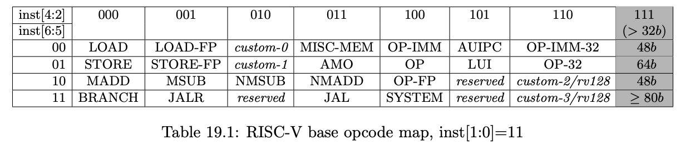

- [Adding custom instruction to RISC V gnu and simulating with spike](#adding-custom-instruction-to-risc-v-gnu-and-simulating-with-spike)
  - [Step 1 : Build RISCV gnu tools](#step-1--build-riscv-gnu-tools)
  - [Add custom instruction to opcode](#add-custom-instruction-to-opcode)
- [Write program and insert mod instruction](#write-program-and-insert-mod-instruction)
- [Install spike and proxy kernel](#install-spike-and-proxy-kernel)
  - [Run program](#run-program)

## Adding custom instruction to RISC V gnu and simulating with spike

###  Step 1 : Build RISCV gnu tools
```bash
git clone --recursive https://github.com/riscv/riscv-gnu-toolchain
export RISCV=/path/to/install/riscv/toolchain
./configure --prefix=/opt/riscv
make -j `getconf _NPROCESSORS_ONLN` newlib
make install 
```


### Add custom instruction to opcode
A set of python scripts that will generate C headers to be added to gcc/gdb and Chisel toolchains.

```
git clone https://github.com/riscv/riscv-opcodes
cd riscv-opcodes.
```

Open the file riscv-opcodes/opcodes, here you will be able to see the various opcodes and instruction bits assigned to various instructions. Assigned an unused instruction to modulo inst. 
- You need to set the bits 6:0 in the custom-0 and custom-1 range. **Here we actually violate the rules. Because, why not ?**. If you violate you might not be compatible with future iterations of RISC-V
- Specify the types and fields. Here we use R-type to say what fields are used as it is.


```bash
mod     rd rs1 rs2 31..25=1  14..12=0 6..2=0x1A 1..0=3
# Hence the overall encoding is 0000001 rs2 rs1 000 rd 1A3
```

- Generate the opcode
```
cat opcode-mod | ./parse_opcodes -c > temp.h
```

- Copy header to gnu toolchain
```
#define MATCH_MOD 0x200006b                                                    
#define MASK_MOD 0xfe00707f
DECLARE_INSN(mod, MATCH_MOD, MASK_MOD)
```

```
riscv-binutils/include/opcode/riscv-opc.h
riscv-binutils/include/opcode/riscv-opc.h
diff riscv-binutils/include/opcode/riscv-opc.h riscv-binutils/include/opcode/riscv-opc.h
# these files should be identical 
```
- Add entry to implementation
  ```
  {"mod",         0, INSN_CLASS_I,   "d,s,t",  MATCH_MOD, MASK_MOD, match_opcode, 0 },
  ```

-  Add this entry either as the last or first entry.

  ```
  riscv-gdb/opcodes/riscv-opc.c
  riscv-gdb/opcodes/riscv-opc.c
  ```

- Rebuild 

```bash
make -j `getconf _NPROCESSORS_ONLN`
make install
```

## Write program and insert mod instruction

```
export RISCV=/path/to/toolchain
export PATH=$RISCV/bin:$PATH
```

```
riscv64-unknown-elf-gcc mod.c -o mod
riscv64-unknown-elf-objdump -dC mod | grep mod 
```


## Install spike and proxy kernel

- Build spike (instruction set simulator for RISC V)
```
git clone ssh://git@github.com/riscv/riscv-isa-sim.git
cd riscv-isa-sim
mkdir build
cd build
../configure --prefix=$RISCV
make -j `getconf _NPROCESSORS_ONLN`; make install
```

- Build pk (proxy kernel for RISC V)
```
git clone ssh://git@github.com/riscv/riscv-pk.git
mkdir build
cd build
../configure --prefix=$RISCV --host=riscv64-unknown-elf
make -j `getconf _NPROCESSORS_ONLN`; make install

```


- Step 1. Add the decoding information. In the `riscv-isa-sim/riscv/encoding.h` add the following lines:

```C
#define MATCH_MOD 0x200006b                                                    
#define MASK_MOD 0xfe00707f
...
DECLARE_INSN(mod, MATCH_MOD, MASK_MOD)
```

- Step 2. Add the functional emulation
Create a file riscv-isa-sim/riscv/insns/mod.h and add these lines:
```C
WRITE_RD(sext_xlen(RS1 % RS2));
```
Add this file to `riscv-isa-sim/riscv/riscv.mk.in`

```Makefile
riscv_insn_list = \
      ...
      mod \
      ...
```

In `riscv-isa-sim/spike_main/disasm.cc` add the following lines:

```C
DEFINE_RTYPE(mod);
```
And now build riscv-tools again. The “mod” instruction has been added to spike simulator


### Run program

```bash
spike pk mod
```