# Fine-tuning and Reinforcement Learning for CPU Memory Behavior Optimization

- [Fine-tuning and Reinforcement Learning for CPU Memory Behavior Optimization](#fine-tuning-and-reinforcement-learning-for-cpu-memory-behavior-optimization-1)
  - [🎯 Project Overview](#-project-overview)
    - [Key Research Questions](#key-research-questions)
  - [System Architecture Overview](#system-architecture-overview)
    - [🏛️ **Overall System Architecture**](#️-overall-system-architecture)
    - [🔄 **Detailed Workflow and Training Pipeline**](#-detailed-workflow-and-training-pipeline)
    - [🎯 **Training Integration and Feedback Loops**](#-training-integration-and-feedback-loops)
    - [📊 **Performance Metrics and Evaluation Framework**](#-performance-metrics-and-evaluation-framework)
    - [Key Integration Points](#key-integration-points)
      - [🔄 **Benchmark → Tools Integration**](#-benchmark--tools-integration)
      - [🔄 **Tools → LLM Integration**](#-tools--llm-integration)
      - [🔄 **LLM → Benchmark Integration**](#-llm--benchmark-integration)
  - [1. 📊 Benchmark Suite for CPU Memory Optimization](#1--benchmark-suite-for-cpu-memory-optimization)
    - [1.1 🏗️ Cache-Conscious Data Structure Benchmarks](#11-️-cache-conscious-data-structure-benchmarks)
      - [**Data Layout Optimization Challenges**](#data-layout-optimization-challenges)
      - [**Matrix Storage and Access Pattern Benchmarks**](#matrix-storage-and-access-pattern-benchmarks)
    - [1.2 🔄 Loop Optimization Benchmarks](#12--loop-optimization-benchmarks)
      - [**Loop Transformation Categories**](#loop-transformation-categories)
      - [**Advanced Optimization Techniques**](#advanced-optimization-techniques)
    - [1.3 🎯 DSL and Code Generation Benchmarks](#13--dsl-and-code-generation-benchmarks)
      - [**Domain-Specific Language Optimizations**](#domain-specific-language-optimizations)
      - [**Code Generation and Auto-tuning Framework**](#code-generation-and-auto-tuning-framework)
    - [1.4 📊 Specific Benchmark Suites](#14--specific-benchmark-suites)
      - [**Benchmark Suite Overview**](#benchmark-suite-overview)
  - [2. Lifting: Advanced Code Representations for LLMs](#2-lifting-advanced-code-representations-for-llms)
    - [2.1 What is Lifting?](#21-what-is-lifting)
    - [2.2 Key Lifting Concepts](#22-key-lifting-concepts)
      - [2.2.1 Types of Lifting](#221-types-of-lifting)
      - [2.2.2 Applications in CPU Memory Optimization](#222-applications-in-cpu-memory-optimization)
    - [2.3 Research Foundation: Key Papers](#23-research-foundation-key-papers)
      - [2.3.1 Lifting and Normalizing Flow-based Generative Models (2024)](#231-lifting-and-normalizing-flow-based-generative-models-2024)
      - [2.3.2 Lift: A Machine Learning Approach to Auto-Generating String Processing Kernels (2015)](#232-lift-a-machine-learning-approach-to-auto-generating-string-processing-kernels-2015)
      - [2.3.3 From C to TACO: Lifting Low-Level Code to High-Level Tensor Operations (2023)](#233-from-c-to-taco-lifting-low-level-code-to-high-level-tensor-operations-2023)
    - [2.4 How Lifting Improves LLM Representations](#24-how-lifting-improves-llm-representations)
      - [2.4.1 Cognitive Benefits for Models](#241-cognitive-benefits-for-models)
      - [2.4.2 Memory Optimization Specific Benefits](#242-memory-optimization-specific-benefits)
    - [2.5 Lifting Implementation Strategy for This Project](#25-lifting-implementation-strategy-for-this-project)
      - [2.5.1 AST-Based Lifting](#251-ast-based-lifting)
      - [2.5.2 Performance Pattern Lifting](#252-performance-pattern-lifting)
      - [2.5.3 DSL Integration with Lifting](#253-dsl-integration-with-lifting)
    - [2.6 Lifting in Multi-Turn Training](#26-lifting-in-multi-turn-training)
      - [2.6.1 Progressive Lifting Strategy](#261-progressive-lifting-strategy)
      - [2.6.2 Reward Function Integration](#262-reward-function-integration)
    - [2.7 Expected Benefits from Lifting Integration](#27-expected-benefits-from-lifting-integration)
      - [2.7.1 Improved Model Performance](#271-improved-model-performance)
      - [2.7.2 Research Contributions](#272-research-contributions)
  - [3. Memory Profiling: Teaching LLMs Performance Behavior Understanding](#3-memory-profiling-teaching-llms-performance-behavior-understanding)
    - [3.1 Memory Profiling for LLM Training](#31-memory-profiling-for-llm-training)
    - [3.2 Key Memory Performance Metrics](#32-key-memory-performance-metrics)
      - [3.2.1 Cache Miss Rate and Block Size Relationships](#321-cache-miss-rate-and-block-size-relationships)
      - [3.2.2 Cache Size vs Performance Relationships](#322-cache-size-vs-performance-relationships)
      - [3.2.3 Memory Level Parallelism (MLP)](#323-memory-level-parallelism-mlp)
      - [3.2.4 Block Utilization Efficiency](#324-block-utilization-efficiency)
    - [3.3 Research Foundation: Memory Performance Analysis](#33-research-foundation-memory-performance-analysis)
      - [3.3.1 Uncertainty Quantification in Performance Analysis (2013)](#331-uncertainty-quantification-in-performance-analysis-2013)
      - [3.3.2 Memory Performance Modeling and Analysis (2013)](#332-memory-performance-modeling-and-analysis-2013)
      - [3.3.3 Cache Performance Analysis and Optimization (1998)](#333-cache-performance-analysis-and-optimization-1998)
      - [3.3.4 Memory Hierarchy Performance Analysis (2001)](#334-memory-hierarchy-performance-analysis-2001)
    - [3.4 Memory Profiling Integration for LLM Training](#34-memory-profiling-integration-for-llm-training)
      - [3.4.1 Profiling-Enhanced Training Data](#341-profiling-enhanced-training-data)
      - [3.4.2 Performance-Aware Reward Functions](#342-performance-aware-reward-functions)
      - [3.4.3 Multi-Turn Feedback with Memory Analysis](#343-multi-turn-feedback-with-memory-analysis)
    - [3.5 Memory Behavior Teaching Strategies](#35-memory-behavior-teaching-strategies)
      - [3.5.1 Progressive Complexity Training](#351-progressive-complexity-training)
      - [3.5.2 Visualization and Interpretation](#352-visualization-and-interpretation)
    - [3.6 Expected Benefits for LLM Performance](#36-expected-benefits-for-llm-performance)
      - [3.6.1 Enhanced Understanding](#361-enhanced-understanding)
      - [3.6.2 Improved Optimization Quality](#362-improved-optimization-quality)
      - [3.6.3 Training Efficiency](#363-training-efficiency)
    - [3.7 Implementation Roadmap](#37-implementation-roadmap)
      - [3.7.1 Profiling Infrastructure Development](#371-profiling-infrastructure-development)
      - [3.7.2 Training Integration](#372-training-integration)
  - [📅 **Project Timeline and Milestones**](#-project-timeline-and-milestones)
    - [🗓️ **12-Week Development Timeline**](#️-12-week-development-timeline)
    - [🎯 **Key Milestones and Deliverables**](#-key-milestones-and-deliverables)
    - [📊 **Resource Allocation and Dependencies**](#-resource-allocation-and-dependencies)
  - [4. Task List and Implementation TODOs](#4-task-list-and-implementation-todos)
    - [Phase 1: Environment Setup and Baseline (Weeks 1-2)](#phase-1-environment-setup-and-baseline-weeks-1-2)
      - [TODO 1.1: Development Environment](#todo-11-development-environment)
      - [TODO 1.2: Baseline Benchmark Implementation](#todo-12-baseline-benchmark-implementation)
    - [Phase 2: Memory Profiling and Analysis (Weeks 3-4)](#phase-2-memory-profiling-and-analysis-weeks-3-4)
      - [TODO 2.1: CPU Cache Profiling Integration](#todo-21-cpu-cache-profiling-integration)
      - [TODO 2.2: Baseline Performance Database](#todo-22-baseline-performance-database)
    - [Phase 3: LLM Fine-tuning Infrastructure (Weeks 5-6)](#phase-3-llm-fine-tuning-infrastructure-weeks-5-6)
      - [TODO 3.1: Fine-tuning Pipeline](#todo-31-fine-tuning-pipeline)
      - [TODO 3.2: Training Data Preparation](#todo-32-training-data-preparation)
    - [Phase 4: Multi-turn Reinforcement Learning (Weeks 7-8)](#phase-4-multi-turn-reinforcement-learning-weeks-7-8)
      - [TODO 4.1: Multi-turn Framework Implementation](#todo-41-multi-turn-framework-implementation)
      - [TODO 4.2: Training Execution](#todo-42-training-execution)
    - [Phase 5: Evaluation and Analysis (Weeks 9-10)](#phase-5-evaluation-and-analysis-weeks-9-10)
      - [TODO 5.1: Comprehensive Evaluation](#todo-51-comprehensive-evaluation)
      - [TODO 5.2: Ablation Studies](#todo-52-ablation-studies)
    - [Phase 6: Documentation and Results (Weeks 11-12)](#phase-6-documentation-and-results-weeks-11-12)
      - [TODO 6.1: Research Documentation](#todo-61-research-documentation)
      - [TODO 6.2: Code and Artifact Release](#todo-62-code-and-artifact-release)
  - [5. 🛠️ Tools and Software Stack](#5-️-tools-and-software-stack)
    - [5.1 Core Development Tools](#51-core-development-tools)
      - [**Programming Languages and Frameworks**](#programming-languages-and-frameworks)
      - [**Memory Analysis and Profiling Tools**](#memory-analysis-and-profiling-tools)
      - [**Benchmark and Testing Frameworks**](#benchmark-and-testing-frameworks)
    - [5.2 Development Environment Setup](#52-development-environment-setup)
      - [**Hardware Requirements**](#hardware-requirements)
      - [**Software Environment Configuration**](#software-environment-configuration)
    - [5.3 Specialized Tools for Memory Optimization](#53-specialized-tools-for-memory-optimization)
      - [**Custom Analysis Tools**](#custom-analysis-tools)
      - [Bandwidth Measurement Tools](#bandwidth-measurement-tools)
  - [6. Expected Research Outcomes](#6-expected-research-outcomes)
    - [6.1 Technical Contributions](#61-technical-contributions)
    - [6.2 Performance Targets](#62-performance-targets)
    - [6.3 Research Deliverables](#63-research-deliverables)
  - [7. Learning Objectives and Skills Development](#7-learning-objectives-and-skills-development)
    - [7.1 Technical Skills](#71-technical-skills)
    - [7.2 Computer Architecture Concepts](#72-computer-architecture-concepts)
    - [7.3 Software Engineering Practices](#73-software-engineering-practices)
  - [8. Risk Mitigation and Contingency Plans](#8-risk-mitigation-and-contingency-plans)
    - [8.1 Technical Risks](#81-technical-risks)
    - [8.2 Timeline Risks](#82-timeline-risks)
    - [8.3 Fallback Options](#83-fallback-options)
  - [9. Success Metrics and Evaluation](#9-success-metrics-and-evaluation)
    - [9.1 Quantitative Metrics](#91-quantitative-metrics)
    - [9.2 Qualitative Analysis](#92-qualitative-analysis)


# Fine-tuning and Reinforcement Learning for CPU Memory Behavior Optimization

**Project Duration:** 8-12 weeks  
**Prerequisites:** Basic knowledge of C/C++, Python, computer architecture fundamentals  
**Goal:** Optimize CPU memory behavior and data structures using LLM-based fine-tuning and reinforcement learning techniques

---

## 🎯 Project Overview

This research project explores **fine-tuning and reinforcement learning techniques** to train Large Language Models (LLMs) for generating memory-efficient CPU code. We focus on developing a comprehensive framework that combines:

1. **📊 Benchmark Suite**: 100 carefully designed problems spanning data structures, matrix operations, loop optimizations, and DSL code generation
2. **🔧 Advanced Profiling**: Integration of CPU cache analysis, memory pattern recognition, and performance lifting techniques  
3. **🤖 Intelligent Training**: Multi-turn reinforcement learning with memory-aware reward functions and progressive curriculum learning

The project aims to create LLMs that understand and optimize memory hierarchy behavior, producing code with measurable improvements in cache efficiency, memory bandwidth utilization, and overall performance.

### Key Research Questions
1. Can LLMs learn to optimize CPU cache hierarchies and memory access patterns through reinforcement learning?
2. How effectively can LLMs discover cache-conscious data structure designs and layouts?
3. What benchmarks best capture CPU memory optimization challenges including tiling and loop transformations?
4. Can LLMs learn to generate efficient code in domain-specific languages like Halide?
5. How does multi-turn refinement compare to single-shot optimization for complex CPU optimizations?

## System Architecture Overview

The following comprehensive diagrams illustrate the integrated relationship between benchmarks, profiling tools, and LLM training in our memory optimization research framework:

### 🏛️ **Overall System Architecture**

```mermaid
graph TB
    subgraph "📊 Benchmark Suite"
        B1[Data Structure Optimization<br/>• AoS vs SoA layouts<br/>• Cache-conscious data structures<br/>• Memory pool allocators]
        B2[Matrix & Linear Algebra<br/>• Tiling strategies<br/>• Loop blocking<br/>• BLAS optimizations]
        B3[Loop Transformations<br/>• Loop fusion/fission<br/>• Vectorization patterns<br/>• Cache blocking]
        B4[DSL Code Generation<br/>• Halide scheduling<br/>• Polyhedral optimization<br/>• Auto-tuning]
    end

    subgraph "🔧 Profiling & Analysis Tools"
        T1[Memory Profiling<br/>• Intel VTune<br/>• perf/cachegrind<br/>• Custom cache simulators]
        T2[Performance Analysis<br/>• Cache miss analysis<br/>• Bandwidth measurement<br/>• MLP analysis]
        T3[Code Lifting<br/>• AST extraction<br/>• Pattern recognition<br/>• Mathematical lifting]
        T4[Visualization<br/>• Performance heatmaps<br/>• Memory access patterns<br/>• Optimization suggestions]
    end

    subgraph "🤖 LLM Training Pipeline"
        L1[Multi-Turn Training<br/>• GRPO optimization<br/>• Progressive refinement<br/>• Curriculum learning]
        L2[Reward Functions<br/>• Cache efficiency<br/>• Bandwidth utilization<br/>• Code correctness]
        L3[Feedback Generation<br/>• Performance analysis<br/>• Optimization suggestions<br/>• Error correction]
        L4[Model Specialization<br/>• Memory-aware fine-tuning<br/>• Pattern learning<br/>• Cross-domain transfer]
    end

    subgraph "💾 Data Flow & Storage"
        D1[Code Samples<br/>Training Data]
        D2[Profiling Data<br/>Performance Metrics]
        D3[Performance Metrics<br/>Cache Statistics]
        D4[Optimized Code<br/>Model Outputs]
    end

    %% Benchmark to Tools connections
    B1 --> T1
    B2 --> T1
    B3 --> T1
    B4 --> T1
    
    B1 --> T3
    B2 --> T3
    B3 --> T3
    B4 --> T3

    %% Tools to Training connections
    T1 --> L2
    T2 --> L2
    T3 --> L1
    T4 --> L3

    %% Data flow connections
    B1 --> D1
    B2 --> D1
    B3 --> D1
    B4 --> D1
    
    T1 --> D2
    T2 --> D3
    
    L1 --> D4
    L4 --> D4

    %% Feedback loops
    D3 --> L3
    D4 --> T2
    L3 --> L1

    style B1 fill:#e1f5fe
    style B2 fill:#e1f5fe
    style B3 fill:#e1f5fe
    style B4 fill:#e1f5fe
    
    style T1 fill:#f3e5f5
    style T2 fill:#f3e5f5
    style T3 fill:#f3e5f5
    style T4 fill:#f3e5f5
    
    style L1 fill:#e8f5e8
    style L2 fill:#e8f5e8
    style L3 fill:#e8f5e8
    style L4 fill:#e8f5e8
```



### 🔄 **Detailed Workflow and Training Pipeline**

```mermaid
flowchart TD
    Start([🚀 Project Start]) --> Setup[🛠️ Environment Setup<br/>• Development tools<br/>• Profiling infrastructure<br/>• Baseline benchmarks]
    
    Setup --> Generate[📊 Benchmark Generation<br/>• 100 optimization problems<br/>• 4 difficulty levels<br/>• Multi-domain coverage]
    
    Generate --> Profile[🔍 Performance Profiling<br/>• Cache behavior analysis<br/>• Memory pattern extraction<br/>• Bottleneck identification]
    
    Profile --> Lift[⬆️ Code Lifting<br/>• AST transformation<br/>• Pattern abstraction<br/>• Mathematical representation]
    
    Lift --> Prepare[📝 Training Data Preparation<br/>• Code-performance pairs<br/>• Profiling augmentation<br/>• Curriculum organization]
    
    Prepare --> Train{🎯 Training Phase}
    
    Train --> Finetune[🔧 Fine-tuning<br/>• Memory-aware objectives<br/>• Performance-guided learning<br/>• Pattern recognition]
    
    Train --> Reinforce[🔄 Reinforcement Learning<br/>• Multi-turn optimization<br/>• Performance rewards<br/>• Iterative refinement]
    
    Finetune --> Evaluate[📈 Evaluation<br/>• Benchmark performance<br/>• Optimization quality<br/>• Generalization testing]
    
    Reinforce --> Evaluate
    
    Evaluate --> Analyze[🔬 Analysis & Validation<br/>• Performance improvements<br/>• Error analysis<br/>• Ablation studies]
    
    Analyze --> Deploy[🚀 Deployment & Results<br/>• Model release<br/>• Documentation<br/>• Research publication]
    
    %% Feedback loops
    Evaluate --> |Poor Performance| Train
    Analyze --> |Need More Data| Generate
    
    style Start fill:#4CAF50,color:#fff
    style Deploy fill:#2196F3,color:#fff
    style Train fill:#FF9800,color:#fff
    style Evaluate fill:#9C27B0,color:#fff
```



### 🎯 **Training Integration and Feedback Loops**

```mermaid
sequenceDiagram
    participant B as 📊 Benchmarks
    participant T as 🔧 Tools
    participant L as 🤖 LLM
    participant P as 📈 Performance
    participant F as 🔄 Feedback

    Note over B,F: Phase 1: Data Collection & Profiling
    B->>T: Generate code samples
    T->>T: Profile memory behavior
    T->>P: Extract performance metrics
    P->>F: Create training dataset
    
    Note over B,F: Phase 2: Model Training
    F->>L: Provide augmented training data
    L->>L: Fine-tune with memory objectives
    L->>P: Generate optimization candidates
    P->>F: Measure performance improvements
    
    Note over B,F: Phase 3: Multi-Turn Refinement
    loop Optimization Iterations
        F->>L: Present challenge + context
        L->>L: Generate optimization
        L->>T: Submit optimized code
        T->>P: Profile and measure
        P->>F: Calculate rewards
        F->>L: Provide detailed feedback
    end
    
    Note over B,F: Phase 4: Evaluation & Validation
    P->>B: Test on held-out benchmarks
    B->>T: Validate optimization quality
    T->>F: Report comprehensive metrics
    F->>L: Final performance assessment
```



### 📊 **Performance Metrics and Evaluation Framework**


### Key Integration Points

#### 🔄 **Benchmark → Tools Integration**
- **Automated Profiling**: Each benchmark automatically triggers comprehensive memory profiling
- **Multi-Metric Analysis**: Cache behavior, bandwidth utilization, and MLP measurement
- **Pattern Extraction**: Automatic identification of optimization opportunities

#### 🔄 **Tools → LLM Integration**  
- **Rich Training Data**: Profiling data enhances training samples with performance context
- **Real-Time Feedback**: Live performance analysis during multi-turn training
- **Reward Function Design**: Memory metrics directly influence model optimization

#### 🔄 **LLM → Benchmark Integration**
- **Iterative Refinement**: Models progressively improve on benchmark challenges
- **Cross-Domain Learning**: Optimization patterns learned from one benchmark apply to others
- **Performance Validation**: Generated optimizations tested against benchmark baselines

---

## 1. 📊 Benchmark Suite for CPU Memory Optimization

> **Goal**: Create a comprehensive suite of 100 benchmarks across 4 difficulty levels to train LLMs in CPU memory optimization techniques.

### 1.1 🏗️ Cache-Conscious Data Structure Benchmarks

#### **Data Layout Optimization Challenges**

| **Category** | **Description** | **Optimization Focus** | **Difficulty** |
|--------------|-----------------|------------------------|----------------|
| **AoS vs SoA** | Array-of-Structures vs Structure-of-Arrays | Spatial locality improvement | ⭐⭐ |
| **Cache-Friendly DS** | B+ trees, hash tables, skip lists | Cache line utilization | ⭐⭐⭐ |
| **Memory Allocators** | Custom pools, stack allocators | Fragmentation reduction | ⭐⭐⭐⭐ |

<details>
<summary><strong>📋 Detailed Benchmark Specifications</strong></summary>

**🔹 Array-of-Structures vs Structure-of-Arrays (AoS vs SoA)**
- Particle systems with different data layouts
- Database-style record processing
- Vector operations with different field access patterns
- Performance comparison across different cache sizes

**🔹 Cache-Friendly Data Structures**
- B+ trees vs binary trees for cache performance
- Hash tables with cache-aware bucket sizing
- Linked lists vs cache-friendly alternatives (deque, vector)
- Skip lists with optimized node layouts

**🔹 Memory Pool and Custom Allocators**
- Object pool allocators for reduced fragmentation
- Stack allocators for temporal locality
- Ring buffers with cache line awareness
- Memory-mapped data structures

</details>

#### **Matrix Storage and Access Pattern Benchmarks**

| **Category** | **Techniques** | **Performance Metrics** |
|--------------|----------------|------------------------|
| **Matrix Layouts** | Row-major, column-major, blocked, sparse formats | Cache miss rate, spatial locality |
| **Tiling Strategies** | L1/L2/L3 optimized tiles, adaptive sizing | Memory bandwidth, compute intensity |
| **BLAS Optimizations** | GEMM, GEMV, triangular solvers | FLOPS/byte, vectorization efficiency |

<details>
<summary><strong>📋 Matrix Optimization Details</strong></summary>

**🔹 Matrix Layout Optimizations**
- Row-major vs column-major storage performance
- Blocked/tiled matrix storage formats
- Sparse matrix formats (CSR, CSC, COO, Block Sparse)
- Cache-oblivious matrix algorithms

**🔹 Matrix Tiling and Blocking Strategies**
- Different tile sizes for L1/L2/L3 cache optimization
- Adaptive tiling based on matrix dimensions
- Multi-level tiling for deep cache hierarchies
- Register blocking and software pipelining

**🔹 BLAS-level Optimizations**
- GEMM (matrix multiplication) with optimal blocking
- GEMV (matrix-vector) memory access optimization
- Triangular solve with cache-aware algorithms
- In-place vs out-of-place transformations

</details>

### 1.2 🔄 Loop Optimization Benchmarks

#### **Loop Transformation Categories**

| **Category** | **Description** | **Optimization Focus** | **Difficulty** |
|--------------|-----------------|------------------------|----------------|
| **Loop Tiling/Blocking** | 2D/3D stencils, matrix operations | Temporal/spatial locality | ⭐⭐⭐ |
| **Loop Fusion/Fission** | Producer-consumer chains | Cache reuse optimization | ⭐⭐ |
| **Loop Interchange** | Multi-dimensional traversals | Memory stride reduction | ⭐⭐⭐ |
| **Software Pipelining** | Overlapping computation | ILP and memory latency hiding | ⭐⭐⭐⭐ |

<details>
<summary><strong>📋 Loop Transformation Techniques</strong></summary>

**🔹 Loop Tiling/Blocking**
- 2D/3D stencil computations with different tile sizes
- Image processing filters with cache blocking
- Nested loop optimizations for matrix operations
- Temporal tiling for time-step algorithms

**🔹 Loop Fusion and Fission**
- Multiple array operations with fusion opportunities
- Producer-consumer loop chains
- Loop distribution for better cache utilization
- Vectorization-friendly loop restructuring

**🔹 Loop Interchange and Permutation**
- Multi-dimensional array traversals
- Cache-friendly iteration order discovery
- Memory stride optimization
- Register pressure reduction through reordering

</details>

#### **Advanced Optimization Techniques**

| **Category** | **Techniques** | **Performance Impact** |
|--------------|----------------|------------------------|
| **Software Pipelining** | Instruction scheduling, register allocation | ILP improvement, latency hiding |
| **Loop Unrolling** | Manual/automatic unrolling factors | Branch reduction, vectorization |
| **Prefetching** | Software/hardware prefetch placement | Memory latency mitigation |
| **Strength Reduction** | Induction variable optimization | Arithmetic operation reduction |

<details>
<summary><strong>📋 Advanced Loop Optimization Details</strong></summary>

**🔹 Software Pipelining and Unrolling**
- Manual loop unrolling with different factors
- Software pipelining for overlapping computation
- Strength reduction in loop bodies
- Induction variable optimization

**🔹 Prefetching and Memory Access Patterns**
- Software prefetching instruction placement
- Stream prefetching for sequential access
- Irregular access pattern optimization
- Cache miss prediction and mitigation

</details>

### 1.3 🎯 DSL and Code Generation Benchmarks

#### **Domain-Specific Language Optimizations**

| **Category** | **Description** | **Optimization Focus** | **Difficulty** |
|--------------|-----------------|------------------------|----------------|
| **Halide Scheduling** | Image processing pipeline optimization | Compute/storage placement | ⭐⭐⭐⭐ |
| **Auto-tuning** | Parameter space exploration | Schedule optimization | ⭐⭐⭐ |
| **Tensor DSLs** | Mathematical expression optimization | Memory layout, computation order | ⭐⭐⭐⭐ |
| **Polyhedral** | Loop nest transformation | Dependency analysis, parallelization | ⭐⭐⭐⭐ |

<details>
<summary><strong>📋 Halide-Style Optimizations</strong></summary>

**🔹 Halide Pipeline Optimizations**
- Image processing pipelines with different schedules
- Compute_at vs store_at placement strategies
- Vectorization directive optimization
- Parallel directive placement and granularity

**🔹 Schedule Search Space Exploration**
- Auto-tuning different tile sizes
- Vectorization width optimization  
- Parallelization strategy selection
- Memory layout transformation (interleave, transpose)

**🔹 Domain-Specific Code Generation**
- Stencil computations with boundary conditions
- Convolution operations with different kernel sizes
- Reduction operations with temporal locality
- Complex multi-stage image processing pipelines

</details>

#### **Code Generation and Auto-tuning Framework**

| **Framework** | **Capabilities** | **Research Application** |
|---------------|------------------|-------------------------|
| **Halide** | Functional image processing, auto-scheduling | Schedule optimization learning |
| **TVM/Relay** | Tensor optimization, graph-level scheduling | End-to-end optimization |
| **Polyhedral** | Loop transformation, dependency analysis | Mathematical optimization |
| **Custom DSLs** | Domain-specific optimizations | Pattern learning and generation |

### 1.4 📊 Specific Benchmark Suites

> **Comprehensive Suite**: 100 benchmarks across 4 difficulty levels to systematically train LLMs in memory optimization techniques.

#### **Benchmark Suite Overview**

| **Suite** | **Focus Area** | **# Problems** | **Difficulty Range** | **Key Metrics** |
|-----------|----------------|----------------|---------------------|-----------------|
| **Suite 1** | Data Structure Optimization | 25 | ⭐⭐ to ⭐⭐⭐⭐ | Cache miss rate, spatial locality |
| **Suite 2** | Matrix & Linear Algebra | 25 | ⭐⭐ to ⭐⭐⭐⭐ | Memory bandwidth, FLOPS/byte |
| **Suite 3** | Loop Transformations | 25 | ⭐⭐ to ⭐⭐⭐⭐ | ILP, vectorization efficiency |
| **Suite 4** | DSL & Code Generation | 25 | ⭐⭐⭐ to ⭐⭐⭐⭐ | Schedule quality, auto-tuning |

<details>
<summary><strong>📋 Suite 1: Data Structure Optimization (25 problems)</strong></summary>

**🔹 Cache-Conscious Data Structures (8 problems)**
- B+ trees vs binary trees for cache performance
- Hash table implementations with different probing strategies
- Skip lists with optimized node layouts
- Cache-friendly graph representations (adjacency lists vs matrices)

**🔹 Memory Layout Optimizations (8 problems)**
- AoS vs SoA transformations for different workloads
- Structure padding and alignment optimizations
- Memory pool allocators for different object sizes
- Custom allocators for temporal locality

**🔹 Dynamic Data Structures (9 problems)**
- Vector growth strategies and cache impact
- Deque vs list performance characteristics
- Memory-mapped data structure implementations
- Lock-free data structures with cache considerations

</details>

<details>
<summary><strong>📋 Suite 2: Matrix and Linear Algebra (25 problems)</strong></summary>

**🔹 Matrix Multiplication Optimization (8 problems)**
- GEMM with different blocking strategies
- Cache-oblivious matrix multiplication
- Strassen's algorithm with memory optimization
- Mixed-precision matrix operations

**🔹 Decomposition and Factorization (8 problems)**
- LU decomposition with pivoting and tiling
- QR decomposition with cache-friendly algorithms
- Cholesky decomposition optimization
- SVD with memory-efficient implementations

**🔹 Sparse and Specialized Operations (9 problems)**
- Sparse matrix operations (SpMV, SpMM) with different formats
- FFT implementations with cache-friendly access patterns
- Eigenvalue algorithms with memory optimization
- Iterative solvers with preconditioner optimization

</details>

<details>
<summary><strong>📋 Suite 3: Loop Transformation (25 problems)</strong></summary>

**🔹 Stencil and Scientific Computing (8 problems)**
- 2D/3D heat equation solvers with tiling
- Conway's Game of Life optimization
- Fluid dynamics simulations (Navier-Stokes)
- Monte Carlo methods with memory efficiency

**🔹 Image and Signal Processing (8 problems)**
- Convolution kernels with different optimization strategies
- Gaussian blur with separable filters
- Edge detection algorithms (Sobel, Canny)
- Morphological operations optimization

**🔹 Algorithm Optimization (9 problems)**
- Sorting algorithms with cache-aware optimizations
- String processing algorithms with memory efficiency
- Graph algorithms (BFS, DFS) with locality optimization
- Dynamic programming with memory-conscious implementations

</details>

<details>
<summary><strong>📋 Suite 4: DSL and Code Generation (25 problems)</strong></summary>

**🔹 Halide-Style Pipelines (8 problems)**
- Multi-stage image processing with schedule optimization
- Camera ISP pipeline implementation
- Computer vision algorithms (optical flow, stereo)
- Medical imaging preprocessing chains

**🔹 Tensor Operation Optimization (8 problems)**
- TensorFlow XLA-style optimizations
- PyTorch JIT compilation improvements
- Custom tensor operation implementations
- Mixed-precision training optimizations

**🔹 Domain-Specific Compilers (9 problems)**
- Database query optimization with memory awareness
- Compiler intermediate representation optimization
- Custom DSL implementations for specific domains
- Auto-tuning framework development

</details>

---

## 2. Lifting: Advanced Code Representations for LLMs

### 2.1 What is Lifting?

**Lifting** is a program transformation technique that elevates low-level code representations to higher-level, more abstract forms that capture semantic meaning and optimization opportunities. In the context of LLM-based code optimization, lifting helps models understand code structure, data flow, and optimization patterns more effectively.

### 2.2 Key Lifting Concepts

#### 2.2.1 Types of Lifting
1. **Semantic Lifting**: Transforming imperative code into functional or mathematical representations
2. **Structural Lifting**: Converting linear code sequences into hierarchical representations (ASTs, CFGs)
3. **Pattern Lifting**: Abstracting common optimization patterns into reusable templates
4. **Domain Lifting**: Elevating code to domain-specific representations (e.g., linear algebra operations)

#### 2.2.2 Applications in CPU Memory Optimization
- **Data Layout Lifting**: Automatically inferring optimal memory layouts from access patterns
- **Loop Structure Lifting**: Converting nested loops into mathematical iteration spaces
- **Dependency Lifting**: Extracting data dependencies for parallel optimization
- **Performance Model Lifting**: Creating abstract performance models from concrete implementations
- **Cache Pattern Lifting**: Abstracting memory access patterns for cache optimization

### 2.3 Research Foundation: Key Papers

#### 2.3.1 Lifting and Normalizing Flow-based Generative Models (2024)
- **Reference**: [arXiv:2401.03003](https://arxiv.org/pdf/2401.03003)
- **Contribution**: Explores how lifting transformations can improve neural network representations
- **Relevance**: Demonstrates mathematical foundations for lifting in machine learning contexts
- **Key Insights**: 
  - Lifting can reduce model complexity while preserving essential information
  - Hierarchical representations enable better generalization
  - Mathematical lifting preserves semantic properties while simplifying learning

#### 2.3.2 Lift: A Machine Learning Approach to Auto-Generating String Processing Kernels (2015)
- **Reference**: [ACM Digital Library](https://dl.acm.org/doi/10.1145/2813885.2737974)
- Life assembly to higher-level C code
  
#### 2.3.3 From C to TACO: Lifting Low-Level Code to High-Level Tensor Operations (2023)
- **Reference**: [PDF](https://www.pure.ed.ac.uk/ws/portalfiles/portal/376980317/C2TACO_SOUZA_MAGALHAES_DOA03092023_AFV_CC_BY.pdf)
- **Contribution**: Practical framework for translating imperative code to tensor algebra representations
- **Relevance**: Demonstrates how lifting helps LLMs understand and optimize tensor computations
- **Key Insights**:
  - Automated lifting from C to tensor operations
  - Significant performance improvements through mathematical representations
  - LLMs can learn optimization patterns more effectively from lifted code

### 2.4 How Lifting Improves LLM Representations

#### 2.4.1 Cognitive Benefits for Models
1. **Reduced Complexity**: Abstract representations are easier for models to learn and generalize from
2. **Semantic Understanding**: Higher-level representations capture programmer intent rather than just syntax
3. **Pattern Recognition**: Lifted code exposes optimization patterns that are obscured in low-level implementations
4. **Cross-Domain Transfer**: Abstract patterns learned in one domain can be applied to different problem spaces
5. **Compositional Reasoning**: Hierarchical representations enable better reasoning about program structure

#### 2.4.2 Memory Optimization Specific Benefits
1. **Cache Pattern Recognition**: Lifted representations make cache-friendly patterns more apparent to models
2. **Data Layout Optimization**: Abstract data flow analysis reveals optimal memory layouts
3. **Loop Transformation**: Mathematical representations enable systematic loop optimization
4. **Cross-Platform Portability**: High-level patterns can be specialized for different CPU architectures

### 2.5 Lifting Implementation Strategy for This Project

#### 2.5.1 AST-Based Lifting
```python
# Example: Lifting matrix multiplication to mathematical representation
def lift_matrix_multiply(c_code):
    """Convert C matrix multiplication to mathematical notation"""
    ast = parse_c_code(c_code)
    
    # Extract loop structure
    loops = extract_nested_loops(ast)
    
    # Identify matrix operations
    matrix_ops = identify_matrix_operations(loops)
    
    # Lift to mathematical representation
    math_repr = convert_to_tensor_notation(matrix_ops)
    
    return math_repr
```

#### 2.5.2 Performance Pattern Lifting
```python
# Example: Abstract cache optimization patterns
class CachePatternLifter:
    def __init__(self):
        self.patterns = {
            'blocking': BlockingPattern(),
            'tiling': TilingPattern(),
            'prefetching': PrefetchingPattern(),
            'aos_to_soa': LayoutTransformPattern()
        }
    
    def lift_code(self, code):
        """Lift code to abstract optimization patterns"""
        ast = parse_code(code)
        patterns = self.identify_patterns(ast)
        lifted_repr = self.create_abstract_representation(patterns)
        return lifted_repr
```

#### 2.5.3 DSL Integration with Lifting
```python
# Example: Halide as lifted representation
def lift_to_halide(image_processing_code):
    """Convert imperative image processing to Halide functional representation"""
    # Parse imperative code
    operations = extract_image_operations(image_processing_code)
    
    # Create Halide functional representation
    halide_func = create_halide_pipeline(operations)
    
    # Enable automatic scheduling optimization
    halide_func.auto_schedule()
    
    return halide_func
```

### 2.6 Lifting in Multi-Turn Training

#### 2.6.1 Progressive Lifting Strategy
1. **Level 1**: Syntactic lifting (AST representations)
2. **Level 2**: Semantic lifting (mathematical representations)
3. **Level 3**: Pattern lifting (optimization templates)
4. **Level 4**: Domain lifting (DSL representations)

#### 2.6.2 Reward Function Integration
```python
def compute_lifting_aware_reward(original_code, optimized_code):
    """Reward function that considers lifting quality"""
    
    # Traditional performance metrics
    perf_reward = measure_performance_improvement(original_code, optimized_code)
    
    # Lifting quality metrics
    lifting_quality = assess_lifting_quality(optimized_code)
    pattern_recognition = measure_pattern_abstraction(optimized_code)
    generalizability = assess_cross_domain_applicability(optimized_code)
    
    # Combined reward
    total_reward = (0.4 * perf_reward + 
                   0.2 * lifting_quality + 
                   0.2 * pattern_recognition + 
                   0.2 * generalizability)
    
    return total_reward
```

### 2.7 Expected Benefits from Lifting Integration

#### 2.7.1 Improved Model Performance
- **Better Pattern Recognition**: Models learn optimization patterns more effectively
- **Faster Convergence**: Abstract representations reduce learning complexity
- **Enhanced Generalization**: Lifted patterns transfer across different code contexts
- **Reduced Training Data Requirements**: Abstract patterns capture more information per example

#### 2.7.2 Research Contributions
- **Novel Lifting Techniques**: Develop CPU-specific lifting strategies for memory optimization
- **Benchmark Suite with Lifting**: Create benchmarks that include both low-level and lifted representations
- **Lifting-Aware Training**: Design training procedures that leverage multiple abstraction levels
- **Performance Analysis**: Quantify the impact of lifting on optimization quality

---

## 3. Memory Profiling: Teaching LLMs Performance Behavior Understanding

### 3.1 Memory Profiling for LLM Training

**Memory profiling** provides crucial performance feedback that enables LLMs to understand the relationship between code structure and execution performance. By incorporating detailed memory behavior analysis into the training process, models can learn to associate specific coding patterns with cache performance, memory bandwidth utilization, and overall system efficiency.

### 3.2 Key Memory Performance Metrics

#### 3.2.1 Cache Miss Rate and Block Size Relationships
Understanding how cache miss rates vary with block size is fundamental for teaching LLMs about memory hierarchy optimization:

**Miss Rate vs Block Size Dynamics:**
- **Compulsory Misses**: Decrease as block size increases (more data loaded per miss)
- **Capacity Misses**: May increase with larger blocks (fewer blocks fit in cache)
- **Conflict Misses**: Complex relationship depending on access patterns and cache associativity

```python
# Example: Teaching LLMs about block size optimization
def analyze_block_size_impact(code, block_sizes=[32, 64, 128, 256]):
    """Analyze how different block sizes affect cache performance"""
    results = {}
    
    for block_size in block_sizes:
        # Simulate cache behavior with different block sizes
        cache_sim = CacheSimulator(block_size=block_size, cache_size=32*1024)
        
        # Profile memory accesses
        access_trace = generate_memory_trace(code)
        miss_rate = cache_sim.simulate(access_trace)
        
        results[block_size] = {
            'miss_rate': miss_rate,
            'compulsory_misses': cache_sim.compulsory_misses,
            'capacity_misses': cache_sim.capacity_misses,
            'conflict_misses': cache_sim.conflict_misses
        }
    
    return results
```

#### 3.2.2 Cache Size vs Performance Relationships
Cache size impact analysis helps LLMs understand working set behavior and locality principles:

**Key Relationships:**
- **Working Set Size**: Performance cliff when data exceeds cache capacity
- **Temporal Locality**: Larger caches benefit algorithms with temporal reuse
- **Spatial Locality**: Cache line utilization efficiency

#### 3.2.3 Memory Level Parallelism (MLP)
MLP measures how many memory operations can be outstanding simultaneously:

**MLP Characteristics:**
- **Sequential Access**: Low MLP, limited by memory latency
- **Strided Access**: Moderate MLP, depends on stride and prefetcher effectiveness
- **Random Access**: High potential MLP but poor cache performance

#### 3.2.4 Block Utilization Efficiency
Block utilization measures how much of each cache line is actually used:

**Utilization Metrics:**
- **Spatial Utilization**: Bytes used / bytes loaded per cache line
- **Temporal Utilization**: Number of accesses to each loaded cache line
- **Effective Bandwidth**: Useful data rate considering utilization

### 3.3 Research Foundation: Memory Performance Analysis

#### 3.3.1 Uncertainty Quantification in Performance Analysis (2013)
- **Reference**: [Utah University Paper](https://www.sci.utah.edu/~roni/for-roni/uncertainty.pdf)
- **Contribution**: Framework for understanding performance variability and measurement uncertainty
- **Relevance**: Helps LLMs understand that performance metrics have inherent uncertainty
- **Key Insights**:
  - Performance measurements contain noise that affects learning
  - Statistical analysis methods for robust performance evaluation
  - Uncertainty quantification improves model training reliability

#### 3.3.2 Memory Performance Modeling and Analysis (2013)
- **Reference**: [OSTI Technical Report](https://www.osti.gov/servlets/purl/1058106)
- **Contribution**: Comprehensive analysis of memory subsystem performance characteristics
- **Relevance**: Provides theoretical foundation for memory behavior understanding
- **Key Insights**:
  - Mathematical models for cache miss rate prediction
  - Performance scaling laws for different memory access patterns
  - Relationship between algorithmic structure and memory performance

#### 3.3.3 Cache Performance Analysis and Optimization (1998)
- **Reference**: [ACM Paper](https://dl.acm.org/doi/pdf/10.1145/299649.299772)
- **Contribution**: Foundational work on cache behavior analysis and optimization techniques
- **Relevance**: Establishes core principles for cache-aware algorithm design
- **Key Insights**:
  - Cache miss categorization and analysis methods
  - Impact of data layout on cache performance
  - Compiler optimization techniques for cache efficiency

#### 3.3.4 Memory Hierarchy Performance Analysis (2001)
- **Reference**: [ACM Digital Library](https://dl.acm.org/doi/10.1145/503272.503287)
- **Contribution**: Advanced analysis of multi-level memory hierarchy performance
- **Relevance**: Provides framework for understanding complex memory interactions
- **Key Insights**:
  - Multi-level cache interaction effects
  - Memory bandwidth and latency trade-offs
  - Performance modeling for hierarchical memory systems

### 3.4 Memory Profiling Integration for LLM Training

#### 3.4.1 Profiling-Enhanced Training Data
```python
class MemoryProfiledBenchmark:
    """Benchmark with integrated memory profiling for LLM training"""
    
    def __init__(self, name, code_template):
        self.name = name
        self.code_template = code_template
        self.profiler = MemoryProfiler()
        
    def generate_training_sample(self):
        """Generate training sample with memory profiling data"""
        
        # Compile and run baseline code
        baseline_metrics = self.profiler.profile_code(self.code_template)
        
        # Create rich profiling context for LLM
        profiling_context = f"""
        Memory Performance Analysis:
        
        Cache Behavior:
        - L1 miss rate: {baseline_metrics['l1_miss_rate']:.2%}
        - L2 miss rate: {baseline_metrics['l2_miss_rate']:.2%}
        - L3 miss rate: {baseline_metrics['l3_miss_rate']:.2%}
        
        Memory Access Patterns:
        - Spatial locality: {baseline_metrics['spatial_locality']:.2f}
        - Temporal locality: {baseline_metrics['temporal_locality']:.2f}
        - Memory level parallelism: {baseline_metrics['mlp']:.2f}
        
        Block Utilization:
        - Cache line utilization: {baseline_metrics['block_utilization']:.2%}
        - Effective bandwidth: {baseline_metrics['effective_bandwidth']:.1f} GB/s
        
        Performance Bottlenecks:
        {self.identify_bottlenecks(baseline_metrics)}
        
        Optimization Opportunities:
        {self.suggest_optimizations(baseline_metrics)}
        """
        
        return {
            'code': self.code_template,
            'profiling_data': baseline_metrics,
            'profiling_context': profiling_context
        }
```

#### 3.4.2 Performance-Aware Reward Functions
```python
def compute_memory_aware_reward(original_code, optimized_code):
    """Reward function incorporating detailed memory behavior analysis"""
    
    # Profile both versions
    original_profile = profile_memory_behavior(original_code)
    optimized_profile = profile_memory_behavior(optimized_code)
    
    # Cache efficiency improvement
    cache_improvement = compute_cache_improvement(original_profile, optimized_profile)
    
    # Memory bandwidth utilization
    bandwidth_improvement = compute_bandwidth_improvement(original_profile, optimized_profile)
    
    # Block utilization efficiency
    utilization_improvement = compute_utilization_improvement(original_profile, optimized_profile)
    
    # Memory level parallelism enhancement
    mlp_improvement = compute_mlp_improvement(original_profile, optimized_profile)
    
    # Weighted reward combining all factors
    reward = (0.3 * cache_improvement +
             0.25 * bandwidth_improvement +
             0.25 * utilization_improvement +
             0.2 * mlp_improvement)
    
    return reward

def compute_cache_improvement(original, optimized):
    """Compute cache performance improvement score"""
    l1_improvement = (original['l1_miss_rate'] - optimized['l1_miss_rate']) / original['l1_miss_rate']
    l2_improvement = (original['l2_miss_rate'] - optimized['l2_miss_rate']) / original['l2_miss_rate']
    l3_improvement = (original['l3_miss_rate'] - optimized['l3_miss_rate']) / original['l3_miss_rate']
    
    # Weighted by cache level importance
    return 0.5 * l1_improvement + 0.3 * l2_improvement + 0.2 * l3_improvement
```

#### 3.4.3 Multi-Turn Feedback with Memory Analysis
```python
class MemoryAwareTrainer:
    """Multi-turn trainer with detailed memory behavior feedback"""
    
    def generate_memory_feedback(self, code, performance_metrics):
        """Generate specific feedback about memory performance"""
        
        feedback_components = []
        
        # Cache miss analysis
        if performance_metrics['l1_miss_rate'] > 0.1:
            feedback_components.append(
                f"High L1 cache miss rate ({performance_metrics['l1_miss_rate']:.2%}). "
                f"Consider improving spatial locality through data layout optimization or loop tiling."
            )
        
        # Block utilization analysis
        if performance_metrics['block_utilization'] < 0.5:
            feedback_components.append(
                f"Low cache line utilization ({performance_metrics['block_utilization']:.2%}). "
                f"Consider restructuring data access patterns to use more data per cache line."
            )
        
        # Memory level parallelism
        if performance_metrics['mlp'] < 2.0:
            feedback_components.append(
                f"Low memory level parallelism ({performance_metrics['mlp']:.1f}). "
                f"Consider software prefetching or data layout changes to enable parallel memory operations."
            )
        
        # Bandwidth utilization
        if performance_metrics['bandwidth_utilization'] < 0.3:
            feedback_components.append(
                f"Low memory bandwidth utilization ({performance_metrics['bandwidth_utilization']:.2%}). "
                f"Consider vectorization or memory access pattern optimization."
            )
        
        return " ".join(feedback_components)
```

### 3.5 Memory Behavior Teaching Strategies

#### 3.5.1 Progressive Complexity Training
```python
class MemoryBehaviorCurriculum:
    """Curriculum for teaching memory behavior understanding"""
    
    def __init__(self):
        self.levels = [
            # Level 1: Basic cache concepts
            {
                'name': 'Cache Basics',
                'concepts': ['cache lines', 'spatial locality', 'temporal locality'],
                'benchmarks': ['array_traversal', 'matrix_access_patterns']
            },
            
            # Level 2: Cache hierarchy
            {
                'name': 'Cache Hierarchy',
                'concepts': ['L1/L2/L3 interactions', 'capacity vs conflict misses'],
                'benchmarks': ['matrix_multiplication', 'stencil_computations']
            },
            
            # Level 3: Advanced memory patterns
            {
                'name': 'Advanced Patterns',
                'concepts': ['memory level parallelism', 'prefetching', 'blocking'],
                'benchmarks': ['sparse_matrix_ops', 'image_processing']
            },
            
            # Level 4: System-level optimization
            {
                'name': 'System Optimization',
                'concepts': ['NUMA effects', 'memory bandwidth', 'cache coherence'],
                'benchmarks': ['parallel_algorithms', 'data_structure_optimization']
            }
        ]
```

#### 3.5.2 Visualization and Interpretation
```python
def create_memory_behavior_visualization(profiling_data):
    """Create visualizations to help LLMs understand memory behavior"""
    
    visualizations = {
        # Cache miss rate vs working set size
        'miss_rate_curve': plot_miss_rate_vs_working_set(profiling_data),
        
        # Memory access pattern heatmap
        'access_pattern': create_access_pattern_heatmap(profiling_data),
        
        # Block utilization distribution
        'block_utilization': plot_block_utilization_histogram(profiling_data),
        
        # Memory level parallelism over time
        'mlp_timeline': plot_mlp_timeline(profiling_data),
        
        # Cache hierarchy pressure
        'cache_pressure': visualize_cache_hierarchy_usage(profiling_data)
    }
    
    return visualizations
```

### 3.6 Expected Benefits for LLM Performance

#### 3.6.1 Enhanced Understanding
- **Causal Relationships**: Models learn how code changes affect memory behavior
- **Performance Intuition**: Development of intuitive understanding of performance trade-offs
- **Pattern Recognition**: Better recognition of memory-efficient coding patterns
- **Cross-Domain Transfer**: Memory optimization insights applicable across different algorithms

#### 3.6.2 Improved Optimization Quality
- **Targeted Optimizations**: More precise optimization strategies based on bottleneck analysis
- **Measurable Improvements**: Quantifiable performance gains through memory behavior optimization
- **Robust Solutions**: Optimizations that work across different input sizes and memory hierarchies
- **System Awareness**: Understanding of how optimizations interact with hardware characteristics

#### 3.6.3 Training Efficiency
- **Faster Convergence**: Rich profiling data accelerates learning of performance relationships
- **Better Generalization**: Understanding of fundamental memory principles improves transfer
- **Reduced Overfitting**: Performance-based feedback prevents memorization of specific cases
- **Curriculum Learning**: Progressive complexity enables systematic skill development

### 3.7 Implementation Roadmap

#### 3.7.1 Profiling Infrastructure Development
- **Week 1-2**: Integrate cache simulators and profiling tools
- **Week 3-4**: Develop performance metric extraction and analysis
- **Week 5-6**: Create visualization and feedback generation systems
- **Week 7-8**: Validate profiling accuracy and overhead

#### 3.7.2 Training Integration
- **Week 9-10**: Incorporate profiling data into training pipeline
- **Week 11-12**: Implement memory-aware reward functions
- **Week 13-14**: Develop curriculum learning with memory complexity
- **Week 15-16**: Evaluate training effectiveness with memory profiling

---

## 📅 **Project Timeline and Milestones**

### 🗓️ **12-Week Development Timeline**


### 🎯 **Key Milestones and Deliverables**

| **Week** | **Phase** | **Milestone** | **Deliverables** | **Success Criteria** |
|----------|-----------|---------------|------------------|--------------------|
| **1-2** | Setup | Environment & Baselines | Development environment, 10 benchmarks | All tools functional, benchmarks validated |
| **3-4** | Profiling | Memory Analysis | Profiling integration, performance DB | Accurate cache metrics, baseline measurements |
| **5-6** | Infrastructure | Training Pipeline | Fine-tuning framework, prepared datasets | Training pipeline functional, data validated |
| **7-8** | Training | Model Optimization | Trained models, multi-turn framework | Model converges, performance improvements |
| **9-10** | Evaluation | Testing & Analysis | Comprehensive evaluation, ablation studies | Statistically significant improvements |
| **11-12** | Documentation | Results & Delivery | Research paper, codebase, model release | Complete documentation, reproducible results |

### 📊 **Resource Allocation and Dependencies**

```mermaid
graph LR
    subgraph "👥 Human Resources"
        R1[Research Lead<br/>40h/week]
        R2[Technical Advisor<br/>5h/week]
        R3[Domain Expert<br/>2h/week]
    end
    
    subgraph "💻 Computational Resources"
        C1[Development Machine<br/>RTX 4090, 64GB RAM]
        C2[Training Cluster<br/>Multi-GPU setup]
        C3[Cloud Resources<br/>AWS/GCP for scaling]
    end
    
    subgraph "📚 Knowledge Resources"
        K1[Academic Papers<br/>Memory optimization]
        K2[Technical Documentation<br/>Tools and frameworks]
        K3[Benchmark Datasets<br/>Existing performance data]
    end
    
    R1 --> C1
    R1 --> C2
    R2 --> K1
    R3 --> K2
    C2 --> C3
    K1 --> K3
```



---

## 4. Task List and Implementation TODOs

### Phase 1: Environment Setup and Baseline (Weeks 1-2)

#### TODO 1.1: Development Environment
- [ ] Set up C/C++ development environment with modern compilers (GCC 12+, Clang 15+)
- [ ] Install CPU profiling tools (perf, Intel VTune, Cachegrind)
- [ ] Set up Halide development environment
- [ ] Install BLAS libraries (OpenBLAS, Intel MKL, ATLAS)
- [ ] Configure Python environment with NumPy, SciPy scientific stack

#### TODO 1.2: Baseline Benchmark Implementation
- [ ] Implement 10 basic CPU memory benchmarks
- [ ] Create reference implementations in C++ and NumPy
- [ ] Establish cache performance measurement framework
- [ ] Validate benchmark correctness across different architectures

```bash
# Essential tools installation
# Compiler toolchain
sudo apt-get install build-essential cmake ninja-build
sudo apt-get install gcc-12 g++-12 clang-15

# Profiling tools
sudo apt-get install linux-tools-common linux-tools-generic
sudo apt-get install valgrind kcachegrind

# Scientific libraries
sudo apt-get install libblas-dev liblapack-dev libopenblas-dev
pip install numpy scipy matplotlib pandas scikit-learn

# Halide installation
wget https://github.com/halide/Halide/releases/download/v16.0.0/Halide-16.0.0-x86-64-linux.tar.gz
tar -xzf Halide-16.0.0-x86-64-linux.tar.gz
export HALIDE_ROOT=$(pwd)/Halide-16.0.0-x86-64-linux
```

### Phase 2: Memory Profiling and Analysis (Weeks 3-4)

#### TODO 2.1: CPU Cache Profiling Integration
- [ ] Integrate perf and Cachegrind for cache analysis
- [ ] Implement cache miss counting and analysis
- [ ] Create memory bandwidth measurement tools
- [ ] Build data structure access pattern visualization

#### TODO 2.2: Baseline Performance Database
- [ ] Profile all benchmarks on target CPU architectures
- [ ] Create performance baseline database with cache statistics
- [ ] Implement automatic performance regression detection
- [ ] Document cache bottlenecks for each benchmark type

```cpp
// CPU Cache profiling implementation template
#include <linux/perf_event.h>
#include <sys/syscall.h>
#include <unistd.h>

class CPUCacheProfiler {
private:
    int cache_misses_fd;
    int cache_references_fd;
    int instructions_fd;
    
public:
    CPUCacheProfiler() {
        // Initialize perf event file descriptors
        setup_perf_counters();
    }
    
    CacheMetrics profile_function(std::function<void()> func) {
        reset_counters();
        enable_counters();
        
        func();  // Execute the function to profile
        
        disable_counters();
        return read_cache_metrics();
    }
    
private:
    void setup_perf_counters();
    CacheMetrics read_cache_metrics();
};
```

### Phase 3: LLM Fine-tuning Infrastructure (Weeks 5-6)

#### TODO 3.1: Fine-tuning Pipeline
- [ ] Adapt Unsloth for memory optimization tasks
- [ ] Implement multi-turn training framework
- [ ] Create reward function for memory efficiency
- [ ] Set up GRPO training pipeline

#### TODO 3.2: Training Data Preparation
- [ ] Generate training prompts for memory optimization
- [ ] Create memory-focused instruction dataset
- [ ] Implement data augmentation for different memory patterns
- [ ] Validate training data quality

```python
# Training pipeline setup
from unsloth import FastLanguageModel
import torch

class MemoryOptimizationTrainer:
    def __init__(self, model_name="codellama/CodeLlama-7b-hf"):
        self.model, self.tokenizer = FastLanguageModel.from_pretrained(
            model_name=model_name,
            max_seq_length=8192,
            dtype=None,
            load_in_4bit=True,
        )
        
    def prepare_memory_optimization_dataset(self):
        """Create dataset with memory-focused problems"""
        pass
        
    def implement_memory_reward_function(self, generated_code):
        """Reward based on cache efficiency, bandwidth usage"""
        pass
```

### Phase 4: Multi-turn Reinforcement Learning (Weeks 7-8)

#### TODO 4.1: Multi-turn Framework Implementation
- [ ] Implement iterative refinement loop
- [ ] Create memory-specific feedback generation
- [ ] Implement reward shaping for memory metrics
- [ ] Add junk/repetition detection

#### TODO 4.2: Training Execution
- [ ] Train on memory optimization benchmarks
- [ ] Implement curriculum learning (easy→hard benchmarks)
- [ ] Monitor training stability and convergence
- [ ] Prevent reward hacking

```python
# Multi-turn training implementation
class MultiTurnMemoryTrainer:
    def __init__(self, max_refinement_steps=4):
        self.max_refinement_steps = max_refinement_steps
        self.memory_profiler = MemoryProfiler()
        
    def generate_memory_feedback(self, kernel_code, benchmark):
        """Generate feedback about memory efficiency"""
        metrics = self.memory_profiler.profile_kernel(kernel_code, benchmark)
        feedback = f"""
        Memory Analysis:
        - Cache miss rate: {metrics['cache_miss_rate']:.2%}
        - Memory bandwidth utilization: {metrics['bandwidth_util']:.2%}
        - Memory access pattern: {metrics['access_pattern']}
        Suggestions for improvement: {self.generate_suggestions(metrics)}
        """
        return feedback
        
    def compute_memory_reward(self, metrics):
        """Compute reward based on memory efficiency"""
        cache_score = 1.0 - metrics['cache_miss_rate']
        bandwidth_score = metrics['bandwidth_util']
        return 0.5 * cache_score + 0.5 * bandwidth_score
```

### Phase 5: Evaluation and Analysis (Weeks 9-10)

#### TODO 5.1: Comprehensive Evaluation
- [ ] Evaluate trained model on hold-out benchmarks
- [ ] Compare against baseline implementations
- [ ] Analyze memory optimization strategies learned
- [ ] Measure generalization to unseen memory patterns

#### TODO 5.2: Ablation Studies
- [ ] Single-turn vs multi-turn comparison
- [ ] Different reward function variants
- [ ] Impact of different base models
- [ ] Effect of curriculum learning

### Phase 6: Documentation and Results (Weeks 11-12)

#### TODO 6.1: Research Documentation
- [ ] Write comprehensive research report
- [ ] Create visualization of learned optimization strategies
- [ ] Document novel memory patterns discovered
- [ ] Prepare presentation materials

#### TODO 6.2: Code and Artifact Release
- [ ] Clean and document codebase
- [ ] Create reproducible experiment scripts
- [ ] Release benchmark suite
- [ ] Write usage documentation

---

## 5. 🛠️ Tools and Software Stack

### 5.1 Core Development Tools

#### **Programming Languages and Frameworks**

| **Category** | **Tools** | **Version** | **Purpose** |
|--------------|-----------|-------------|------------|
| **Core Languages** | Python, C/C++, CUDA | 3.10+, C++17, 12.1+ | Implementation and optimization |
| **ML Frameworks** | PyTorch, Transformers, Unsloth | 2.1+, 4.35+, latest | LLM training and inference |
| **Scientific** | NumPy, SciPy, Matplotlib | Latest stable | Data analysis and visualization |
| **Build Systems** | CMake, Ninja, Make | 3.20+, latest | Compilation and build automation |

<details>
<summary><strong>📋 Installation Commands</strong></summary>

```bash
# Environment setup
conda create --name memory-opt python=3.10
conda activate memory-opt

# PyTorch and ML tools
pip install torch torchvision torchaudio --index-url https://download.pytorch.org/whl/cu121
pip install unsloth[colab] accelerate transformers datasets

# Scientific computing
pip install numpy scipy matplotlib pandas scikit-learn

# Build tools
sudo apt-get install build-essential cmake ninja-build
```

</details>

#### **Memory Analysis and Profiling Tools**

| **Category** | **Tools** | **Metrics** | **Use Case** |
|--------------|-----------|-------------|--------------|
| **CPU Profiling** | perf, VTune, Valgrind | Cache misses, bandwidth, cycles | CPU memory analysis |
| **GPU Profiling** | Nsight Compute, nvprof | Memory throughput, occupancy | GPU kernel optimization |
| **System Analysis** | Nsight Systems, gem5 | End-to-end performance | System-wide bottlenecks |
| **Memory Debugging** | AddressSanitizer, Valgrind | Memory errors, leaks | Correctness validation |

<details>
<summary><strong>📋 Profiling Tools Installation</strong></summary>

```bash
# CPU profiling tools
sudo apt-get install linux-tools-common linux-tools-generic
sudo apt-get install valgrind kcachegrind intel-vtune

# NVIDIA GPU tools (included with CUDA Toolkit)
# Nsight Compute, Nsight Systems automatically installed

# Python memory tools
pip install memory-profiler pympler psutil
```

</details>

#### **Benchmark and Testing Frameworks**

| **Framework** | **Language** | **Scope** | **Features** |
|---------------|--------------|-----------|--------------|
| **Google Benchmark** | C++ | Microbenchmarks | Statistical analysis, regression detection |
| **pytest-benchmark** | Python | Python functions | Integration with pytest, comparison |
| **KernelBench** | CUDA/Python | GPU kernels | Memory optimization benchmarking |
| **Custom Suite** | Multi-language | CPU memory patterns | Domain-specific optimization |

### 5.2 Development Environment Setup

#### **Hardware Requirements**

| **Component** | **Recommended** | **Minimum** | **Notes** |
|---------------|-----------------|-------------|-----------|
| **GPU** | RTX 4090, A100, H100 | RTX 3080, V100 (8GB+) | CUDA Compute 7.0+ required |
| **RAM** | 64GB+ | 32GB | Large model fine-tuning |
| **Storage** | NVMe SSD 2TB+ | SSD 500GB+ | Fast dataset access |
| **CPU** | 16+ cores | 8+ cores | Parallel data processing |

#### **Software Environment Configuration**

<details>
<summary><strong>📋 CUDA Development Setup</strong></summary>

```bash
# CUDA Toolkit installation
wget https://developer.download.nvidia.com/compute/cuda/12.1.0/local_installers/cuda_12.1.0_530.30.02_linux.run
sudo sh cuda_12.1.0_530.30.02_linux.run

# Environment variables
export CUDA_HOME=/usr/local/cuda-12.1
export PATH=$CUDA_HOME/bin:$PATH
export LD_LIBRARY_PATH=$CUDA_HOME/lib64:$LD_LIBRARY_PATH

# Verify installation
nvcc --version
nvidia-smi
```

</details>

<details>
<summary><strong>📋 Docker Alternative</strong></summary>

```bash
# Pull PyTorch development image
docker pull pytorch/pytorch:2.1.0-cuda12.1-cudnn8-devel

# Run with GPU support
docker run --gpus all -it --rm \
  -v $(pwd):/workspace \
  pytorch/pytorch:2.1.0-cuda12.1-cudnn8-devel
```

</details>

### 5.3 Specialized Tools for Memory Optimization

#### **Custom Analysis Tools**

| **Tool** | **Functionality** | **Output** | **Integration** |
|----------|-------------------|------------|-----------------|
| **Memory Pattern Analyzer** | Access pattern classification | Coalescing efficiency, stride analysis | LLM training data enhancement |
| **Cache Simulator** | Multi-level cache behavior | Miss rates, latency simulation | Performance prediction |
| **Bandwidth Profiler** | Memory throughput measurement | Effective vs theoretical bandwidth | Optimization validation |
| **Performance Visualizer** | Bottleneck identification | Heatmaps, timeline analysis | Human-interpretable feedback |

#### Bandwidth Measurement Tools
```python
# Bandwidth measurement implementation
class BandwidthProfiler:
    def __init__(self, device_id=0):
        self.device_id = device_id
        
    def measure_effective_bandwidth(self, kernel_func, data_size):
        """Measure effective memory bandwidth"""
        # Implementation using CUDA events
        pass
        
    def measure_peak_bandwidth(self):
        """Measure theoretical peak bandwidth"""
        pass
```

---

## 6. Expected Research Outcomes

### 6.1 Technical Contributions
- **Novel benchmark suite** for memory behavior optimization
- **Fine-tuned LLM** specialized in memory-efficient code generation
- **Multi-turn training framework** for iterative memory optimization
- **Comprehensive analysis** of learned memory optimization strategies

### 6.2 Performance Targets
- **10-50% improvement** in cache efficiency on benchmark tasks
- **15-30% increase** in memory bandwidth utilization
- **90%+ correctness** on memory optimization benchmarks
- **Generalizable strategies** that work across different memory hierarchies

### 6.3 Research Deliverables
1. **Research Paper** (8-12 pages) suitable for undergraduate research symposium
2. **Open-source Codebase** with reproducible experiments
3. **Benchmark Suite** for memory optimization evaluation
4. **Trained Model** specialized in memory-efficient code generation
5. **Technical Blog Post** explaining methodology and results

---

## 7. Learning Objectives and Skills Development

### 7.1 Technical Skills
- **GPU Programming**: CUDA kernel development and optimization
- **Memory Systems**: Deep understanding of cache hierarchies and memory patterns
- **Machine Learning**: LLM fine-tuning and reinforcement learning
- **Performance Analysis**: Profiling and optimization techniques
- **Research Methodology**: Experimental design and result analysis

### 7.2 Computer Architecture Concepts
- Memory hierarchy design and behavior
- Cache organization and replacement policies
- Memory bandwidth and latency optimization
- Parallel memory access patterns
- NUMA and multi-level memory systems

### 7.3 Software Engineering Practices
- Large-scale codebase organization
- Performance benchmarking and regression testing
- Documentation and reproducible research
- Version control and collaborative development

---

## 8. Risk Mitigation and Contingency Plans

### 8.1 Technical Risks
- **Hardware limitations**: Plan for cloud computing resources (Google Colab Pro, AWS)
- **Training instability**: Implement multiple checkpointing and smaller model fallbacks
- **Benchmark complexity**: Start with simpler patterns and gradually increase complexity
- **Memory profiling accuracy**: Use multiple tools for cross-validation

### 8.2 Timeline Risks
- **Scope creep**: Focus on core benchmarks first, extensions as stretch goals
- **Tool integration issues**: Plan buffer time for debugging and setup
- **Training time**: Use efficient fine-tuning methods (LoRA, QLoRA) to reduce compute

### 8.3 Fallback Options
- Use smaller models (7B instead of 32B) if compute is limited
- Focus on CPU memory optimization if GPU access is restricted
- Simplify to single-turn training if multi-turn proves too complex
- Evaluate on existing benchmarks if custom suite development takes too long

---

## 9. Success Metrics and Evaluation

### 9.1 Quantitative Metrics
- **Memory efficiency improvement**: Cache miss reduction, bandwidth increase
- **Performance speedup**: Wall-clock time improvement over baselines
- **Correctness rate**: Percentage of generated kernels that compile and run correctly
- **Generalization**: Performance on held-out benchmark tasks

### 9.2 Qualitative Analysis
- **Code quality**: Readability and maintainability of generated optimizations
- **Strategy diversity**: Variety of optimization techniques learned by the model
- **Failure mode analysis**: Understanding when and why the approach fails
- **Human expert evaluation**: Assessment by experienced systems programmers

---

This research project provides a comprehensive introduction to the intersection of machine learning and computer architecture, offering hands-on experience with cutting-edge techniques while contributing to the growing field of AI-assisted code optimization.
